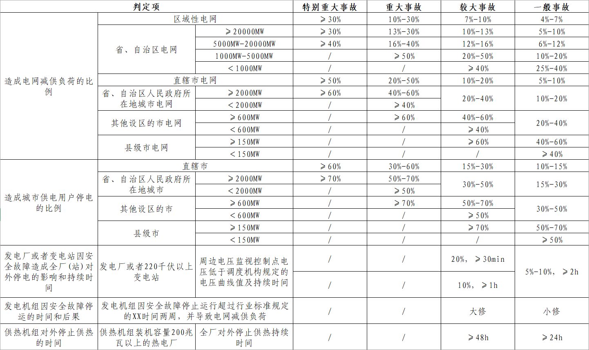
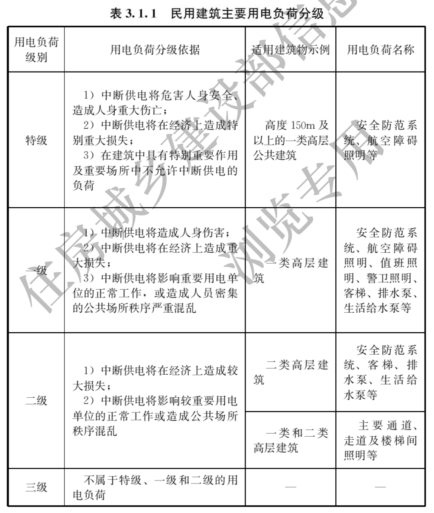
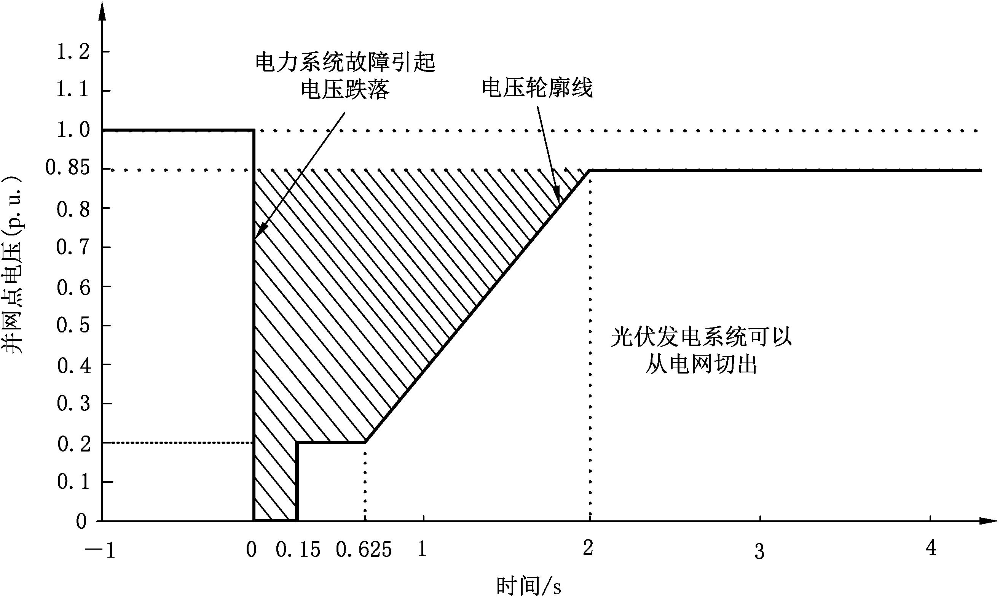
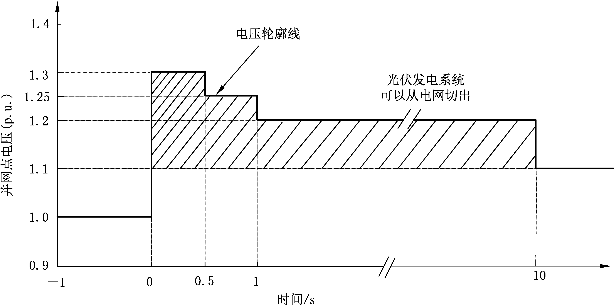
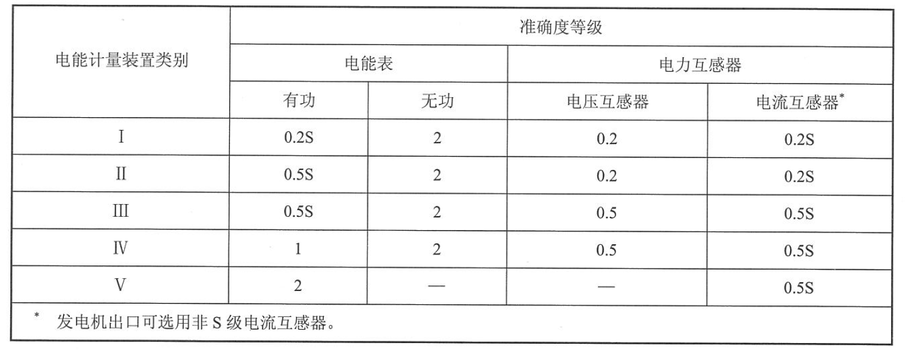

# 知识点梳理

## 一、法律法规

### （一）中华人民共和国能源法

#### 第一章 总则

**第三条** 能源工作应当坚持中国共产党的领导，贯彻**新发展理念**和**总体国家安全观**，统筹**发展**和**安全**，实施推动**能源消费革命**、**能源供给革命**、**能源技术革命**、**能源体制革命**和全方位加强国际合作的能源安全新战略，坚持**立足国内**、**多元保障**、**节约优先**、**绿色发展**，加快构建**清洁低碳**、**安全高效**的新型能源体系。

**第四条** 国家坚持**多措并举**、**精准施策**、**科学管理**、**社会共治**的原则，完善节约能源政策，加强节约能源管理，综合采取**经济**、**技术**、**宣传教育**等措施，促进经济社会发展全过程和各领域全面降低能源消耗，防止能源浪费。

**第五条** 国家完善能源开发利用政策，优化能源**供应结构**和**消费结构**，积极推动能源清洁低碳发展，提高能源利用效率。

**第六条** 国家加快建立**主体多元**、**统一开放**、**竞争有序**、**监管有效**的能源市场体系，依法规范能源市场秩序，平等保护能源市场各类主体的合法权益。

**第七条** 国家完善能源产供储销体系，健全**能源储备制度**和**能源应急机制**，提升能源供给能力，保障能源**安全**、**稳定**、**可靠**、**有效**供给。

**第八条** 国家建立健全能源标准体系，保障能源安全和绿色低碳转型，促进能源**新技术**、**新产业**、**新业态**发展。

**第九条** 国家加强能源科技创新能力建设，支持能源开发利用的**科技研究**、**应用示范**和**产业化发展**，为能源高质量发展提供科技支撑。

**第十条** 国家坚持**平等互利**、**合作共赢**的方针，积极促进能源国际合作。

#### 第二章 能源规划

**第十五条** 国家制定和完善能源规划，发挥能源规划对能源发展的**引领**、**指导**和**规范**作用。
能源规划包括**全国综合能源规划**、**全国分领域能源规划**、**区域能源规划**和**省、自治区、直辖市能源规划**等。

**第十六条** 国务院能源主管部门会同国务院有关部门和有关省、自治区、直辖市人民政府，根据**区域经济社会发展需要**和**能源资源禀赋情况**、**能源生产消费特点**、**生态环境保护要求**等，可以编制跨省、自治区、直辖市的区域能源规划。

**第十八条** 编制能源规划，应当遵循能源发展规律，坚持**统筹兼顾**，强化**科学论证**。

能源规划应当明确规划期内能源发展的**目标**、**主要任务**、**区域布局**、**重点项目**、**保障措施**等内容。

**第十九条** 能源规划按照规定的**权限**和**程序**报经批准后实施。

#### 第三章 能源开发利用

**第二十一条** 国家根据**能源资源禀赋情况**和**经济社会可持续发展**的需要，统筹**保障能源安全**、**优化能源结构**、**促进能源转型和节约能源**、**保护生态环境**等因素，分类制定和完善能源开发利用政策。

**第二十二条** 国家支持**优先开发利用**可再生能源，**合理开发和清洁高效利用**化石能源，推进非化石能源**安全可靠有序替代**化石能源，提高非化石能源消费比重。

国务院能源主管部门会同国务院有关部门制定非化石能源开发利用**中长期**发展目标，按**年度**监测非化石能源开发利用情况，并向社会公布。

**第二十四条** 开发建设和更新改造水电站，应当符合流域相关规划，统筹兼顾**防洪**、**生态**、**供水**、**灌溉**、**航运**等方面的需要。

**第三十一条** 国家加快构建新型电力系统，加强电源电网协同建设，推进电网**基础设施智能化改造**和**智能微电网建设**，提高电网对可再生能源的**接纳**、**配置**和**调控**能力。

**第三十四条** 国家推动提高能源利用效率，鼓励发展分布式能源和**多能互补**、**多能联供**综合能源服务，积极推广**合同能源管理**等**市场化**节约能源服务，提高终端能源消费**清洁化**、**低碳化**、**高效化**、**智能化**水平。
国家通过实施**可再生能源绿色电力证书**等制度建立绿色能源消费促进机制，鼓励能源用户优先使用可再生能源等清洁低碳能源。

**第三十五条** 能源企业、能源用户应当按照国家有关规定配备、使用**能源和碳排放计量器具**。

国家加强能源需求侧管理，通过完善**阶梯价格**、**分时价格**等制度，引导能源用户合理调整用能**方式**、**时间**、**数量**等，促进节约能源和提高能源利用效率。

**第三十六条** 承担电力、燃气、热力等能源供应的企业，应当依照法律、法规和国家有关规定，保障营业区域内的能源用户获得**安全**、**持续**、**可靠**的能源供应服务。

前款规定的企业应当公示**服务规范**、**收费标准**和**投诉渠道**等，并为能源用户提供公共查询服务。

**第三十八条** 国家按照**城乡融合**、**因地制宜**、**多能互补**、**综合利用**、**提升服务**的原则，鼓励和扶持农村的能源发展，重点支持**革命老区**、**民族地区**、**边疆地区**、**欠发达地区**农村的能源发展，提高农村的能源供应能力和服务水平。

农村地区发生临时性能源供应短缺时，**有关地方人民政府**应当采取措施，优先保障农村**生活用能**和**农业生产用能**。

#### 第四章 能源市场体系

**第四十一条** 国家推动能源领域**自然垄断环节独立运营**和**竞争性环节市场化改革**，依法加强对能源领域**自然垄断性业务**的**监管**和**调控**，支持各类经营主体依法按照市场规则公平参与能源领域竞争性业务。

**第四十二条** 国务院能源主管部门会同国务院有关部门协调推动全国统一的煤炭、电力、石油、天然气等能源交易市场建设，推动建立**功能完善**、**运营规范**的市场交易机构或者交易平台，依法拓展**交易方式**和**交易产品范围**，完善**交易机制**和**交易规则**。

**第四十三条** 能源输送管网设施运营企业应当完善公平接入和使用机制，按照规定公开能源输送管网**设施接入和输送能力**以及**运行情况**的信息，向符合条件的企业等经营主体**公平**、**无歧视**开放并提供能源输送服务。

**第四十四条** 国家鼓励能源领域上下游企业通过订立**长期协议**等方式，依法按照市场化方式**加强合作**、**协同发展**，提升能源市场风险应对能力。
国家协同推进能源**资源勘探**、**设计施工**、**装备制造**、**项目融资**、**流通贸易**、**资讯服务**等高质量发展，提升能源领域上下游全链条服务支撑能力。

**第四十五条** 国家推动建立与社会主义市场经济体制相适应，主要由**能源资源状况**、产**品和服务成本**、**市场供求状况**、**可持续发展状况**等因素决定的能源价格形成机制。

#### 第五章 能源储备和应急
**第四十七条** 国家按照**政府主导**、**社会共建**、**多元互补**的原则，建立健全**高效协同**的能源储备体系，科学合理确定能源储备的**种类**、**规模**和**方式**，发挥能源储备的**战略保障**、**宏观调控**和**应对急需**等功能。

**第四十八条** 能源储备实行**政府储备**和**企业储备**相结合，**实物储备**和**产能储备**、**矿产地储备**相统筹。

政府储备包括**中央政府储备**和**地方政府储备**，企业储备包括**企业社会责任储备**和**企业其他生产经营库存**。
能源储备的**收储**、**轮换**、**动用**，依照法律、行政法规和国家有关规定执行。

**第四十九条** 企业社会责任储备按照**企业所有**、**政策引导**、**监管有效**的原则建立。

能源产能储备的具体办法，由国务院**能源主管部门**会同国务院财政部门和其他有关部门制定。
能源矿产地储备的具体办法，由国务院**自然资源主管部门**会同国务院能源主管部门、国务院财政部门和其他有关部门制定。

**第五十条** 国家完善能源储备**监管体制**，加快能源储备**设施建设**，提高能源储备运营主体**专业化水平**，加强能源储备**信息化建设**，持续提升能源储备**综合效能**。

**第五十一条** 国家建立和完善能源预测预警体系，提高能源预测预警能力和水平，及时有效对能源**供求变化**、**能源价格波动**以及**能源安全风险状况**等进行预测预警。

**第五十二条** 国家建立**统一领导**、**分级负责**、**协调联动**的能源应急管理体制。

#### 第六章 能源科技创新

**第五十六条** 国家制定鼓励和支持能源科技创新的政策措施，推动建立以**国家战略科技力量**为**引领**、**企业**为**主体**、**市场**为**导向**、**产学研**深度融合的能源科技创新体系。

**第五十七条** 国家鼓励和支持<u>能源资源勘探开发、化石能源清洁高效利用、可再生能源开发利用、核能安全利用、氢能开发利用以及储能、节约能源</u>等领域**基础性**、**关键性**和**前沿性**重大技术、装备及相关新材料的**研究**、**开发**、**示范**、**推广应用**和**产业化发展**。

**第五十九条** 国家建立重大能源科技创新平台，支持重大能源科技基础设施和能源技术**研发**、**试验**、**检测**、**认证**等公共服务平台建设，提高能源科技**创新能力**和**服务能力**。

**第六十条** 国家支持依托重大能源工程集中开展科技攻关和集成应用示范，推动产学研以及能源上下游**产业链**、**供应链**协同创新。

**第六十一条** 国家支持先进信息技术在能源领域的应用，推动能源生产和供应的**数字化**、**智能化**发展，以及多种能源协同转换与集成互补。

#### 第七章 监督管理

**第六十七条** 因能源输送管网设施的接入、使用发生的争议，可以由**省级以上人民政府**能源主管部门进行协调，协调不成的，当事人可以向人民法院提起诉讼；当事人也可以直接向人民法院提起诉讼。

#### 第八章 法律责任

**第七十条** ……**拒绝**或者**中断**对营业区域内能源用户的能源供应服务，或者**擅自提高价格**、**违法收取费用**、**减少供应数量**、**限制购买数量**的，由**县级以上人民政府**能源主管部门或者其他有关部门按照职责分工责令改正，依法给予**行政处罚**；……

**第七十一条** 能源输送管网设施运营企业未向经营主体公平、无歧视开放并提供能源输送服务的，由**省级以上人民政府**能源主管部门或者其他有关部门按照职责分工责令改正，给予**警告**或者**通报批评**；拒不改正的，处相关经营主体经济损失额**二倍以下**的罚款；……

**第七十二条** 违反本法规定，有下列情形之一的，由**县级以上人民政府**能源主管部门或者其他有关部门按照职责分工责令改正，给予**警告**或者**通报批评**；拒不改正的，处**十万元以上二十万元以下**的罚款：
（一）承担电力、燃气、热力等能源供应的企业未公示**服务规范**、**收费标准**和**投诉渠道**等，或者未为能源用户提供公共查询服务；
（二）能源输送管网设施运营企业未按照规定公开能源输送管网设施**接入和输送能力**以及**运行情况**信息；
（三）能源企业未按照规定提供**价格成本**等相关数据；
（四）有关单位未按照规定向能源主管部门或者其他有关部门报送相关信息。

**第七十三条** ……在能源应急状态时不服从……的统一指挥和安排、未承担能源应急义务或者不配合采取应急处置措施的，由**县级以上人民政府**能源主管部门或者其他有关部门按照职责分工责令改正，给予**警告**或者**通报批评**；拒不改正的，对**个人**处**一万元以上五万元以下**的罚款，对**单位**处**十万元以上五十万元以下**的罚款，并可以根据情节轻重责令停业整顿或者依法吊销相关许可证件。

**第七十四条** 违反本法规定，造成财产损失或者其他损害的，依法承担**民事责任**；构成违反治安管理行为的，依法给予治安管理处罚；构成犯罪的，依法追究刑事责任。

#### 第九章 附则

**第七十五条** 本法中下列用语的含义：
（一）化石能源，是指由远古动植物化石经地质作用演变成的能源，包括煤炭、石油和天然气等。
（二）可再生能源，是指能够在较短时间内通过自然过程不断补充和再生的能源，包括水能、风能、太阳能、生物质能、地热能、海洋能等。
（三）非化石能源，是指不依赖化石燃料而获得的能源，包括可再生能源和核能。
（四）生物质能，是指利用自然界的植物和城乡有机废物通过生物、化学或者物理过程转化成的能源。
（五）氢能，是指氢作为能量载体进行化学反应释放出的能源。

---

**文件2-7待补充**

---

### （八）电力安全事故应急处置和调查处理条例

#### 第一章 总则

**第三条** 根据电力安全事故（以下简称事故）影响电力系统安全稳定运行或者影响电力（热力）正常供应的程度，事故分为**特别重大事故**、**重大事故**、**较大事故**和**一般事故**。

#### 第二章 事故报告

**第八条** 事故发生后，事故现场有关人员应当立即向**发电厂、变电站运行值班人员**、**电力调度机构值班人员**或者**本企业现场负责人**报告。有关人员接到报告后，应当立即向**上一级电力调度机构**和**本企业负责人**报告。本企业负责人接到报告后，应当立即向**国务院电力监管机构设在当地的派出机构**（以下称**事故发生地电力监管机构**）、**县级以上人民政府安全生产监督管理部门**报告。

**第九条** 事故发生地电力监管机构接到事故报告后，应当立即核实有关情况，向**国务院电力监管机构**报告；事故造成供电用户停电的，应当同时通报事故发生地**县级以上地方人民政府**。
对特别重大事故、重大事故，国务院电力监管机构接到事故报告后应当**立即**报告**国务院**，并通报**国务院安全生产监督管理部门**、**国务院能源主管部门等有关部门**。

**第十条** **事故报告**应当包括下列内容：

1. 事故发生的时间、地点（区域）以及事故发生单位；
2. 已知的电力设备、设施损坏情况，停运的发电（供热）机组数量、电网减供负荷或者发电厂减少出力的数值、停电（停热）范围；
3. 事故原因的初步判断；
4. 事故发生后采取的措施、电网运行方式、发电机组运行状况以及事故控制情况；
5. 其他应当报告的情况。

> [!NOTE]
>
> 与[第二十四条](#A8-02)（事故调查报告）区分

**第十一条** 事故发生后，有关单位和人员应当妥善保护事故现场以及**工作日志**、**工作票**、**操作票**等相关材料，及时保存**故障录波图**、**电力调度数据**、**发电机组运行数据**和**输变电设备运行数据**等相关资料，并在事故调查组成立后将相关材料、资料移交事故调查组。

#### 第三章 事故应急处置

**第十二条** 国务院电力监管机构依照**《中华人民共和国突发事件应对法》**和**《国家突发公共事件总体应急预案》**，组织编制国家处置电网大面积停电事件应急预案，报**国务院**批准。

**第十五条** 根据事故的具体情况，电力调度机构可以发布**开启或者关停发电机组**、**调整发电机组有功和无功负荷**、**调整电网运行方式**、**调整供电调度计划**等电力调度命令，发电企业、电力用户应当执行。
事故可能导致破坏电力系统稳定和电网大面积停电的，电力调度机构有权决定采取**拉限负荷**、**解列电网**、**解列发电机组**等必要措施。

**第十九条** 恢复电网运行和电力供应，应当优先保证**重要电厂厂用电源**、**重要输变电设备**、**电力主干网架**的恢复，优先恢复**重要电力用户**、**重要城市**、**重点地区**的电力供应。

**第二十条** 事故应急指挥机构或者电力监管机构应当按照有关规定，**统一**、**准确**、**及时**发布有关**事故影响范围**、**处置工作进度**、**预计恢复供电时间**等信息。

#### 第四章 事故调查处理

**第二十一条** 事故调查机构

| 事故级别     | 调查机构                                 |
| ------------ | ---------------------------------------- |
| 特别重大事故 | 国务院/国务院授权的部门                  |
| 重大事故     | 国务院电力监管机构                       |
| 较大事故     | 发生地电力监管机构（国务院电力监管机构） |
| 一般事故     | 发生地电力监管机构                       |

未造成供电用户停电的一般事故，事故发生地电力监管机构也可以委托事故发生单位调查处理。

**第二十三条** 调查期限

| 事故级别              | 调查期限 | 延长的期限 |
| --------------------- | -------- | ---------- |
| 特别重大事故/重大事故 | 60日     | 不超过60日 |
| 较大事故/一般事故     | 45日     | 不超过45日 |

**第二十四条** **事故调查报告**应当包括下列内容：

1. 事故发生单位概况和事故发生经过；
2. 事故造成的直接经济损失和事故对电网运行、电力（热力）正常供应的影响情况；
3. 事故发生的原因和事故性质；
4. 事故应急处置和恢复电力生产、电网运行的情况；
5. 事故责任认定和对事故责任单位、责任人的处理建议；
6. 事故防范和整改措施。

> [!NOTE]
>
> 与[第十条](#A8-01)（事故报告）区分

#### 第五章 法律责任

**第二十七条** 发生事故的**电力企业主要负责人**有下列行为之一的，由电力监管机构处其上一年年收入**40%至80%**的罚款：
（一）不立即组织事故抢救的；
（二）迟报或者漏报事故的；
（三）在事故调查处理期间擅离职守的。

**第二十八条** 发生事故的**电力企业及其有关人员**有下列行为之一的，由电力监管机构对电力企业处**100万元以上500万元以下**的罚款；对主要负责人、直接负责的主管人员和其他直接责任人员处其上一年年收入**60%至100%**的罚款：

（一）谎报或者瞒报事故的；
（二）伪造或者故意破坏事故现场的；
（三）转移、隐匿资金、财产，或者销毁有关证据、资料的；
（四）拒绝接受调查或者拒绝提供有关情况和资料的；
（五）在事故调查中作伪证或者指使他人作伪证的；
（六）事故发生后逃匿的。

**第二十九条** **电力企业**对事故发生负有责任的，由电力监管机构依照下列规定处以罚款：

| 事故级别     | 下限（万元） | 上限（万元） |
| ------------ | ------------ | ------------ |
| 一般事故     | 10           | 20           |
| 较大事故     | 20           | 50           |
| 重大事故     | 50           | 200          |
| 特别重大事故 | 200          | 500          |

**第三十条** **电力企业主要负责人**未依法履行安全生产管理职责，导致事故发生的，由电力监管机构依照下列规定处以罚款：

| 事故级别     | 上一年年收入百分比 |
| ------------ | ------------------ |
| 一般事故     | 30%                |
| 较大事故     | 40%                |
| 重大事故     | 60%                |
| 特别重大事故 | 80%                |

**第三十一条** 电力企业主要负责人依照本条例……受到撤职处分或者刑事处罚的，自受处分之日或者刑罚执行完毕之日起**5年内**，不得担任任何生产经营单位主要负责人。

**第三十二条** 电力监管机构、有关地方人民政府以及其他负有安全生产监督管理职责的有关部门有下列行为之一的，对直接负责的主管人员和其他直接责任人员依法给予处分；直接负责的主管人员和其他直接责任人员构成犯罪的，依法追究刑事责任：
（一）不立即组织事故抢救的；
（二）迟报、漏报或者瞒报、谎报事故的；
（三）阻碍、干涉事故调查工作的；
（四）在事故调查中作伪证或者指使他人作伪证的。

#### 附：电力安全事故等级划分标准

### （九）国家能源局关于加强用户侧涉网安全管理的通知

1. 各单位要……，推动**技术手段**创新、**管理模式**创新，有效管控涉网安全风险，防范电力安全事故发生。
2. 各省级电力管理部门要组织电网企业及其调度机构，综合考虑系统安全需要，定期梳理可能造成**一般及以上**电力安全事故或对系统安全稳定造成重大影响的电力用户，梳理的重点包括局部**地区负荷占比高的大用户**、**电能质量敏感型用户**、**重要行业用户**、**源荷混合型用户**、**负荷聚合类用户**、**高风险越级跳闸用户**等，按**年度**形成本辖区用户侧涉网安全管理范围的电力用户清单。
3. 电网企业及其调度机构负责相关电力用户涉网安全的**专业管理**。要指导相关电力用户合理安排**运行方式**，加强对涉网设备配置和涉网参数管理的**技术监督**。
4. 电网企业及其调度机构要明确相关电力用户在**规划接入**、**业扩报装**、**并网运行**等阶段的涉网安全要求。要严格开展接入系统的安全可靠性审查，督促相关电力用户规范开展涉网设备设计选型，在**采购**、**监造**、**安装**、**调试**等环节严格质量管控，开展接入**谐波评估**和**谐波治理**。要督促相关电力用户提升涉网设备**载流安全裕度**，定期开展**预防性试验**，及时更换改造老旧设备，严禁设备“带病运行”。
5. 电网企业及其调度机构要指导相关电力用户按标准规范配置涉网**继电保护**和**安全自动装置**，对于**220千伏及以上**电压等级接入的相关电力用户，应要求其在接入系统部分按照**双重化**原则配置**纵联差动保护**。
6. 电网企业及其调度机构要全面梳理相关行业涉电标准与电力行业标准之间的差异，及时将标准差异及由此造成的涉网安全问题报告**地方各级电力管理部门**和**国家能源局派出机构**。
7. 电网企业及其调度机构要持续加强调控能力建设，提升对相关电力用户的“**可观可测**”能力。相关电力用户要按照调度协议要求，将**电气接线**、**装置模型**及**关键运行信息**接入电网调度系统，具备接收和执行调度机构控制和调节指令的能力，满足电网运行“**可调可控**”要求，必要时配合开展**实测建模**。相关电力用户要建立完善设备运维管理等制度，及时消除远动通道故障，确保不影响调度自动化系统信息**采集**、**上传**、**遥控**、**遥调**等。
8. 电网企业及其调度机构深入评估威胁电网侧的安全风险，对相关电力用户提出管控要求，督促用户落实**反事故措施**，定期**更新**用户侧涉网安全风险台账，对构成**一般及以上**电力安全事故风险要及时报告**省级电力管理部门**和**国家能源局派出机构**。
9. 并网自备电厂应纳入调度机构统一管理，遵守调度管理的系列技术规范，落实**二次系统**全过程技术监督。调度机构要督促并网自备电厂按规定完成相关的**涉网试验**、**定值校验**、**预防性试验**等工作，投入**电力系统稳定器**、**一次调频**等维持电网安全稳定的必要功能，严格落实电网**调峰调频**要求。
10. 地方各级电力管理部门要对相关电力用户按**年度**核查涉网安全管理要求落实情况，对于发现的问题要督促整改。
11. 地方各级电力管理部门要指导相关电力用户采取**退出不必要的低压脱扣装置**、合理设置定值、**优化安装位置**等措施，避免装置误动、停电范围扩大等情况。

### （十）关于深化提升“获得电力”服务水平 全面打造现代化用电营商环境的意见

#### Ⅰ. 总体要求

​	以习近平新时代中国特色社会主义思想为指导，全面贯彻党的**二十大**和**二十届二中、三中**全会精神，深入落实“**四个革命**、**一个合作**”能源安全新战略，坚持**人民至上**、**系统推进**、**示范引领**、**分类施策**的原则，持续深化**工作机制**、**服务模式**、**监管体系**改革创新，进一步巩固“**三零**”“**三省**”服务成效，……。到**2029年**，我国基本建成**办电便捷化**、**供电高质化**、**用电绿色化**、**服务普惠化**、**监管协同化**的现代化用电营商环境。

> 四个革命：能源消费革命、能源供给革命、能源技术革命、能源体制革命
>
> 一个合作：全方位加强能源国际合作（能源法第三条）

> 三零：零上门、零审批、零投资
>
> 三省：省力、省时、省钱

#### Ⅱ. 具体细节

1. 全力支持民营经济发展壮大，将低压办电“零投资”扩大至**160千瓦**及以下各类民营经济组织。
2. 各地按照国家有关要求，积极推进电力外线接入工程审批流程优化。逐步推行**告知承诺**、**备案制**等举措，鼓励具备条件的地区实行**非禁免批**。
3. 供电企业推进办电档案数字化建设，实现办电资料**一次提交**、**多场景共用**、**有效期内复用**。
5. 供电企业合理安排配电网建设改造资金，……，加快配电网改造升级，切实提升城乡配电网**供电保障能力**和**综合承载能力**。
7. 持续提升配电线路及台区**电能质量问题分析能力**和**综合治理水平**。
8. 推动基于**实时数据**的电力可靠性管理体系建设，努力实现可靠性数据由人工采集录入逐步过渡到**自动收集**、**自主研判**。
9. 完善配电网**停电监控**、**故障研判**和**自愈控制**策略，减少故障停电次数、停电时间和影响范围。
10. 深化不停电作业技术应用，进一步压减计划检修停电时间，逐步实现重点城市重点区域计划检修“**零感知**”。
11. 供电企业严格按照“**一年内**停电次数不超过**5次**”“**连续60天**停电次数不超过**3次**”标准（因恶劣天气等不可抗力和外力破坏造成的停电除外）进行总体管控，加快问题台区线路“**整线成片**”标准化治理，实现频繁停电问题**动态清零**。
13. 供电企业免费提供**电能监测**、**能效诊断**、**能效咨询**等公共服务。
14. 各地按照“**依法依规、积极稳妥**”原则，充分利用**“两新”资金**等相关支持政策，分类施策，有序推进老旧小区、城中村等供电普遍服务薄弱区域供配电设施规范化改造。
15. 各地要……，共同推动正式用电设施与房屋主体工程**同步验收**、**同步交付使用**。

> [!NOTE]
>
> 注意只有两个“同步”

16. 供电企业应协助开展非电网直供电小区用户产权设备隐患排查，提供必要的**技术服务**。
17. 坚持并发展新时代“**枫桥经验**”，聚合政企网格资源，政企联动开展“**电力客户经理+政务网格员**”联合服务，统一城乡供电服务标准、规范网格服务流程，基本形成城乡**均等化**供电服务体系。。
18. 国家发展改革委、国家能源局强化**顶层设计**和**整体协调**，建立健全工作推进机制，统筹做好全国深化提升“获得电力”服务水平工作。

#### Ⅲ. 时限要求（附件）

| 用户类型                   | 业务受理 | 供电方案答复 | 设计审查 | 中间检查 | 竣工检验 | 装表接电 | 合计 |
| -------------------------- | :------: | :----------: | :------: | :------: | :------: | :------: | :--: |
| 未实行“三零”服务的低压用户 |    1     |      3       |    /     |    /     |    /     |    2     |  6   |
| 高压单电源用户             |    1     |      10      |    3     |    2     |    3     |    3     |  22  |
| 高压双电源用户             |    1     |      20      |    3     |    2     |    3     |    3     |  32  |

实行“三零”服务的低压用户全过程办电时间，无电力外线工程的不超过**5个工作日**，有电力外线工程的不超过**15个工作日**。

### （十一）电能质量管理办法

#### 第一章 总则

**第一条** 为加强……，支撑电力系统的**安全**、**稳定**、**优质**、**经济**运行，依照《中华人民共和国电力法》《电力供应与使用条例》《电网调度管理条例》和《电力监管条例》等法律法规，制定本办法。

**第二条** 本办法适用于在中华人民共和国境内的电力**生产**、**供应**和**使用**过程中的电能质量管理工作。

**第三条** 本办法所称的电能质量管理，是指综合采用**技术**、**经济**、**行政**等手段，使电力系统电能质量限制在国家标准规定范围内，以保证**发电**、**供电**和**用电**三方的正常运行和合法权益的活动，包括**发电电能质量管理**、**输配电电能质量管理**、**用电电能质量管理**，以及**信息管理**、**监督管理**等。

**第四条** 电能质量管理应当遵循“**标准指引**、**预防为主**、**综合治理**”的方针，发电、供电和用电各方应在工程项目**规划**、**设计**、**建设**、**运行**的全过程贯彻电能质量主动防治的理念，共同维护电气安全使用环境。

**第五条** 保障电力系统电能质量是发电企业、电网企业、电力用户的**共同责任**。建立健全**政府监督管理**、**行业自律**和**企业履责**的机制，强化和落实……的**主体责任**，共同维护电力系统电能质量水平。因发电、电网或用户原因引起电能质量问题时，责任主体应当按“**谁干扰，谁治理**”的原则及时处理，并接受监督管理。

#### 第二章 组织与职责

**第八条** 电网企业负责所属电网电能质量管理工作。负责所属电网电能质量**监测**和**调控**。负责发电并网点和电力用户公共连接点的电能质量管理。

**第十二条** **鼓励**电能质量监测装置、治理设备制造企业加强产品的生产过程控制及检验，确保提供符合标准要求的合格产品。**鼓励**发电企业、电力用户使用经电能质量特性检测认证的发电和用电设备。

#### 第三章 发电电能质量管理

**第十四条** 新（改、扩）建的**新能源场站**、**10千伏及以上**电压等级并网的**分布式电源**和**新型储能**应当在接入电力系统**规划可研阶段**开展电能质量评估，配置**电能质量在线监测装置**，采取必要的电能质量防治措施。治理设备、在线监测装置应当与主体工程**同时设计、同时施工、同时验收、同时投运**。在**试运行阶段**（**6个月内**），应当开展电能质量监测，指标超标时应当主动采取治理措施。

**第十五条** 发电企业应当在生产运行阶段开展电能质量监测工作，针对自身原因引起的电能质量问题主动采取防治措施。新能源发电场站应当配置**电能质量在线监测装置**，并配合问题调查分析，为电能质量指标统计和问题分析提供数据支撑。

**第十六条** 10千伏以下电压等级并网的分布式电源应当配置**具备必要的电能质量监测功能的设备**，并进行电能质量指标超标预警和主动控制。采取防治措施后电能质量仍不符合国家标准，……，应当配合电网企业执行**出力控制**或**离网控制**。

**第十七条** 发电企业应当开展电能质量管理工作相关信息采集与问题分析治理能力建设，建立变流器等**干扰源设备**、**治理设备**、**监测装置**台账库，定期维护更新。

#### 第四章 输配电电能质量管理

**第十九条** 高压直流输电、柔性输电等非线性设施**规划设计**阶段应当开展电能质量评估，配置电能质量在线监测装置，必要时配置电能质量调控设备，且与主体工程**同时设计、同时施工、同时验收、同时投运**。

**第二十条** 干扰源用户消除引起中止供电的原因后，电网企业应当在**24小时**内恢复供电。

**第二十一条** 电网企业应当开展电能质量管理工作相关信息采集与问题分析治理能力建设，建立**电能质量监测**、**调控设备**台账，定期维护更新。

#### 第五章 用电电能质量管理

**第二十二条** 干扰源用户接入电力系统时，应当在**规划可研**阶段开展电能质量评估，采取必要的电能质量防治措施，并与主体工程**同时设计、同时施工、同时验收、同时投运**。在**试运行阶段**（**6个月内**），应当开展电能质量监测，指标超标时应当主动采取治理措施。

> [!NOTE]
>
> 与第十四条相比少一句“配置电能质量在线监测装置”

**第二十三条** 对电能质量有特殊要求的用户在接入电力系统时，应当自行开展**电能质量需求分析**，采用耐受水平与电能质量需求相匹配的用电设备，以及配置合适的电能质量控制设备，确保电能质量满足自身需求。

**第二十五条** 干扰源用户和对电能质量有特殊要求的用户应当建立**干扰源设备**、**对电能质量有特殊需求的设备**、**治理设备**、**监测装置**台账库，定期维护更新。

> [!NOTE]
>
> 与第十七条（发电企业）相比多一个**对电能质量有特殊需求的设备**

#### 第六章 信息管理

**第二十七条** 电能质量信息实行**统一管理**、**分级负责**。**国家能源局**负责全国电能质量信息的管理工作。**地方各级电力管理部门**负责本行政区域内电能质量信息的管理工作。

根据工作需要，国家能源局可以委托**行业协会**、**科研单位**及**技术咨询机构**等<u>协助开展</u>**电能质量信息统计**、**指标评价**等工作。

**第二十八条** 电网企业等相关企业应当按规定**准确**、**及时**、**完整**地向国家能源局、地方各级电力管理部门报送电能质量信息。

#### 第八章 附则

**第三十一条** 本办法下列用语的含义：

（一）电能质量，是指电力系统指定点处的电特性，关系到供用电设备正常工作（或运行）的**电压**、**电流**、**频率**的各种指标偏离基准技术参数的程度。电能质量指标包括**电力系统频率偏差**、**供电电压偏差**、**谐波（间谐波）**、**三相电压不平衡**、**电压波动与闪变**、**电压暂升/暂降与短时中断**等；

（二）干扰源，是指接入电力系统的对电能质量造成影响的**非线性**、**不平衡**、**冲击性**发、供、用电设备或设施。

（三）电能质量监测，是指根据测量准确度要求，使用相应的电能质量监测设备（便携或在线）测量电力系统指定点处的电能质量指标。

## 二、国家标准及规程规范

### （一）用电安全导则

#### 1 范围

本标准规定了电气设备在**设计**、**制造**、**安装**、**使用**和**维修**等全生命周期各阶段实现用电安全的基本要求、在特殊场所和环境条件下用电安全的一般原则及对人员的具体要求。本标准适用于额定电压**交流1000V及以下**、**直流1500V及以下**的各类电气设备和电气装置。

#### 2 术语和定义

| 术语     | 定义                                                         |
| -------- | ------------------------------------------------------------ |
| 电气设备 | 按功能和结构适用于电能应用的产品或部件。包括发电、输电、配电、贮存、测量、控制、调节、转换、监督、保护和消费电能的产品，还包括通信技术领域中的及由它们组合成的电气设备、电气装置和电气器具。 |
| 电气装置 | 为实现特定目的且具有互相协调特性的电气设备的组合。           |
| 电击     | 电流通过人体或动物躯体而引起的生理效应。                     |
| 直接接触 | 人或动物与带电部分的电接触。                                 |
| 间接接触 | 人或动物与**故障情况下**带电的外露可导电部分的电接触。       |
| 保护接地 | 为了电气安全，将系统、装置或设备的一点或多点接地。           |
| 0类设备  | 依靠**基本绝缘**进行防电击保护，即在易接近的导电部分（如果有的话）和设备固定布线中的保护导体之间没有连接措施，在基本绝缘损坏的情况下便依赖于周围环境进行防护的设备。 |
| Ⅰ类设备  | 不仅依靠基本绝缘进行电击保护，而且还包括一个**附加的安全措施**，即把易电击的导电部分连接到设备固定布线中的保护（接地）导体上，使易触及导电部分在基本绝缘失效时，也不会成为带电部分的设备。 |

#### 4 用电产品的制造

用电产品如需要强制性认证的，应取得认证证书或标志。非强制性认证的产品应具备有效的**型式检验报告**。

#### 5 用电产品的安装与使用

1. 当系统接地的形式采用保护接地系统（TT系统）时，应在电路采用**剩余电流保护器**进行保护，并且保护应具有选择性。
   保护接地线应采用**焊接**、**压接**、**螺栓联结**或**其他可靠方法**联结，严禁缠绕或挂钩。
2. 移动使用的用电产品，应采用完整的**铜芯橡皮套软电缆**或**护套软线**作为电源线，移动时，应防止电源线拉断或损坏。
3. 0类设备只能在非导电场所中使用。

### （二）供电服务规范

#### 3 术语和定义

| 术语                   | 定义                                                         |
| ---------------------- | ------------------------------------------------------------ |
| 供电                   | 供电企业向电力用户供应电能的行为。                           |
| 供电企业               | 具有资质，从事供电、增量配电网业务的**企业法人、组织和分支机构**。 |
| 电力用户               | 依法与供电企业形成供用电关系的**组织和个人**。 注1：简称用户。 注2：趸购转售电企业是一类特殊用户。其中，趸购转售指从大电网趸购电能，再向其营业区内的用户售电的经营方式。 |
| 重要电力用户           | 在国家或者一个地区（城市）的社会、政治、经济生活中占有重要地位，对其中断供电将可能造成**人身伤亡**、**较大环境污染**、**较大政治影响**、**较大经济损失**、**社会公共秩序严重混乱**的用电单位或<u>对供电可靠性有特殊要求的用电场所</u>。 |
| 供电服务               | 供电企业遵循一定的标准和规范，以特定的方式和手段，满足电力用户现实或者潜在用电需求的活动。 注：通常包括向电力用户提供质量合格的电能、用电及并网业务办理、电能计量、电费结算、供电故障处理等内容。 |
| 增量配电网             | 除电网企业存量资产外，由**社会资本**投资、建设、运营的配电网。 注：通常指110kV及以下电压等级电网和220（330）kV及以下电压等级工业园区（经济开发区）等局域电网。 |
| 分布式电源             | 在电力用户所在场地或附近建设安装、运行方式以用户侧**自发自用为主**、**多余电量上网**的发电设施。 注：通常包括太阳能、天然气、生物质能、风能、水能、氢能、地热能、海洋能、资源综合利用发电（含煤矿瓦斯发电）和储能等类型。 |
| 电压合格率             | 实际运行电压偏差在限值范围内累计运行时间与对应的总运行统计时间的百分比。 |
| 供电系统用户供电可靠性 | 供电系统对电力用户持续供电的能力。 注：简称供电可靠性。  |
| 平均供电可靠率         | 在统计期间内，对电力用户有效供电时间小时数与统计期间小时数的比值。 |
| 用户受电工程           | 由电力用户出资建设，在办理新装、增容、变更用电等用电业务时涉及的电力工程。 注：简称受电工程。 |
| 供电方式               | 电力供应的方法和形式。 注：一般依据国家有关政策、电力用户用电需求以及电力系统供电能力等因素确定。根据供电电源电压等级的不同，供电方式一般分为高压供电方式和低压供电方式。 |
| 供电（并网）方案       | 电力供应（电源并网）的具体实施计划。 注1：通常包括电力用户基本信息，供电容量，供电电源位置、出线方式，供电回路数和走径，用户进线方式，用户受（送）电装置容量、主接线、继电保护方式、计量方式、运行方式、调度通信，以及用户自备应急电源等内容。并网方案通常包括并网用户基本信息、分布式电源项目基本信息、并网点和并网电压等级、接入容量和接入方式、防雷接地要求、无功配置方案、继电保护方式、调度通信、电能计量方式、产权分界点设置等内容。 注2：按照电压等级划分，一般分为高压方案和低压方案。其中，高压方案为10（6、20）kV及以上电力用户的供电（并网）方案；低压方案为220V或380V电力用户的供电（并网）方案。 |
| 用户自备应急电源       | 由电力用户自行配备的，在正常供电电源全部发生中断的情况下，能满足用户保安负荷可靠供电的独立电源。 注：保安负荷指用于保障用电场所人身与财产安全所需的电力负荷。一般认为，断电后会造成下列后果之一： **a）直接引发人身伤亡的； b）使有毒、有害物溢出，造成环境大面积污染的； c）将引起爆炸或火灾的； d）将引起较大范围社会秩序混乱或在政治上产生严重影响的； e）将造成重大生产设备损坏或引起重大直接经济损失的。** |
| 隐蔽工程               | 被其他工作物遮掩的工程。 注：具体是指地基、电气管线、供水供热管线等需要覆盖、掩盖的工程。 |
| 停电                   | 供电发生中断的状态或行为。 注：根据停电原因的不同，一般分为故障停电、预安排停电以及因用户违法、违约行为造成的停电等。 |
| 限电                   | 当电力供应不足时，为保障电力系统安全和维持合格的电能质量，对一些用电需求进行限制的状态或行为。 |
| 中止供电               | 供电企业中止履行供电义务的状态或行为。                       |

#### 4 供电服务通则

1. 供电企业应按照国家有关规定，履行电力社会普遍服务义务，公开公平地向电力市场交易主体及其电力用户提供报装、计量、抄表、结算、维修等各类供电服务，并按约定履行**保底供应商**义务。
2. 供电企业应执行国家相关政策要求，做好**分布式电源**、**新型储能**和**增量配电网**等项目接入服务，加强电力需求侧管理，向电力用户宣传并指导用户做好**安全用电**、**节约用电**和**科学用电**工作，引导电力用户提升节能降碳意识。

	> [!NOTE]
	>
	> 电力需求侧管理指通过采取有效的激励措施，引导电力用户改变用电方式，提高终端用电效率，优化资源配置，改善和保护环境，实现最小社会成本电力服务所进行的用电管理活动。

#### 5 供电质量

1. 电压偏差

   |      电压等级       |        偏差         |
   | :-----------------: | :-----------------: |
   |     35kV及以上      | 绝对值之和不超过10% |
   | 10（6、20）kV及以下 |         ±7%         |
   |        220V         |      +7%、-10%      |

   > [!NOTE]
   >
   > 35kV及以上，如供电电压上下偏差同号时，按较大的偏差绝对值作为衡量依据；

2. 谐波电压（相电压）限值

   |   电压等级    | 总谐波畸变率 | 奇次谐波电压含有率 | 偶次谐波电压含有率 |
   | :-----------: | :----------: | :----------------: | :----------------: |
   |     110kV     |     2.0%     |        1.6%        |        0.8%        |
   |     35kV      |     3.0%     |        2.4%        |        1.2%        |
   | 10（6、20）kV |     4.0%     |        3.2%        |        1.6%        |
   |     380V      |     5.0%     |        4.0%        |        2.0%        |

3. 频率偏差

   正常情况下±0.2Hz，系统容量较小时±0.5Hz。

4. 电压监测点年电压合格率

   城市地区C类电压监测点不低于98%；
   城市地区D类电压监测点不低于95%；
   农村地区由有关部门根据实际情况规定。

5. 电压监测点的选择

   A类电压监测点为**带地区供电负荷**的**变电站**和**发电厂**的10（6、20）kV母线电压。
   B类电压监测点为20kV、35kV、66kV**专线**供电的和**110kV及以上**供电电压。
   C类电压监测点为20kV、35kV、66kV**非专线**供电的和**10（6）kV**供电电压，每**10MW**负荷至少应设一个电压监测点。
   D类电压监测点为220V/380V低压网络供电电压，每百台配电变压器至少设**2个**电压监测点。监测点应设在有代表性的**低压配电网首末两端**和部分**重要用户**处。

6. 10（6、20）kV电力用户平均供电可靠率

   城市地区不低于99.50%；
   农村地区不低于99%。

7. 35kV及以上电压供电的用户的停电次数，每年不应超过1次；对10（6、20）kV供电的用户，每年不应超过3次。

   > [!NOTE]
   >
   > 频繁停电指因供电企业责任导致10（6、20）kV线路及公变台区发生，1年内（自然年）停电5次及以上、连续60d停电次数3次及以上或年计划检修停电超过3次等。

#### 6 用电及并网业务办理

1. 电力用户申请新装用电、增加用电容量或者变更用电，以及分布式电源并网业务时，供电企业应一次性告知用电业务**办理资料**、**办理流程**、**办理时限**、**双方的权利和义务**、**政府规定的收费项目和收费标准**等内容。
2. 供电企业应针对不同电力用户，按照**依法**、**高效**、**便民**的原则，要求申请用电的用户提供……
3. 供电企业向分布式电源项目提供电网接入服务，受理分布式电源项目接入系统设计方案报告后，应遵循“**公平、公开、高效、安全**”的原则，及时会同分布式电源项目业主对接入系统设计方案进行研究，向分布式电源项目业主出具书面回复意见的期限应不超过**5个工作日**。
4. 供电企业应引导增量配电网、10kV 及以上并网的分布式电源安装电能质量在线监测装置，其中分布式电源的电能质量在线监测装置应具备**一年及以上**历史数据的存储功能。
5. 自受理之日起，供电企业单次审核用户受电工程设计文件和有关资料的期限应符合：
   用户受电工程不超过**3个工作日**；
   分布式电源并网接入工程<u>一般</u>不超过**5个工作日**。
6. 自接到用户并网检验与并网调试申请之日起，供电企业完成电能计量装置安装、购售电合同和并网调度协议等相关材料签署、组织并网检验与调试，并出具并网验收意见的期限应符合：一般不超过**10个工作日**。
7. 给用户供电（并网）前，供电企业应按照有关规定，遵循**平等自愿、协商一致、诚实信用**的原则，与用户签订供用电合同（购售电合同）。
8. 供用电合同主要内容包括：供电方式、供电容量、电能质量、用电性质、用电地址及时间、联系方式、计量方式、电价及电费结算方式、调度通信、供用电设施产权及维护责任的划分、合同有效期、违约责任等。
9. 分布式电源购售电合同主要内容包括：并网方式、产权划分及维护管理、上网电价及补贴价格、电能计量、电费结算与国家补贴转付、合同双方的义务、违约责任等。
10. 代理购售电合同内容一般包括：代理购电价格、代购电结算日期、结算方式与购电费支付、合同双方的义务、违约责任等。

#### 8 电费结算

1. 供电企业应按照相关规定、市场化交易方式或根据营业区范围内用户数量、用电量、用户类别和用户分布情况，与用户约定**抄表周期**和**抄表例日**。
2. 供电企业应加强电量电费核算管理，具备可靠的数据备份和保存方法，确保电量电费核算的各类数据及参数的**完整性、准确性和安全性**。
3. 供电企业应向用户提供不少于**两种**可供选择的交纳电费方式。
4. 对月用电量较大的用户，供电企业可按用户月电费确定每月分**若干次**收费，于抄表后结清当月电费，收费次数由供电企业与用户协商确定，一般每月不少于**3次**，并进行书面约定。

#### 9 供电故障处理

1. 到达抢修现场时限：

   | 地区               | 时限   |
   | ------------------ | ------ |
   | 城区范围           | 45min  |
   | 农村地区           | 90min  |
   | 边远、交通不便地区 | 120min |

#### 11 用电安全服务

1. 供电企业应配合**县级以上政府电力主管部门**开展重要电力用户认定；指导重要电力用户按照有关国家标准配置供电电源和自备应急电源，并做好自备应急电源运维；如发现重要用户的供电电源、自备应急电源等存在安全隐患，应及时告知用户，并将发现的隐患情况及时**报请政府有关部门**督促整改。

   > [!NOTE]
   >
   > 不是供电企业自己督促用户整改

#### 12 服务渠道

1. 供电服务热线电话应具备录音功能，电话录音至少应保留**3个月**。

#### 13 用户投诉处理

1. 对用户的投诉，供电企业应自接到投诉之日起**5个工作日**内提出处理意见并答复用户。

#### 14 信息公开

1. 用户因自身生产、生活、科研等特殊需要，向供电企业申请获取下列信息，供电企业无正当理由的，不应拒绝：

   - 用户自身的用电档案信息、电费计算和交费信息等；

   - 用户用电报装信息和办理进度；

   - 用户设备接入所涉及的供电能力、主变容量和同级电网结构等；

   - 与用户供电相关的继电保护整定参数或整定方案（含继电保护定值的计算机定值单等）。

   趸售用户申请接入电网时，向供电企业申请提供本营业网区的**潮流分布**、**系统阻抗**以及**运行方式**情况等与电网接入相关的信息，供电企业无正当理由的，不应拒绝。

2. 信息公开咨询原则上应即时办理，不能即时回复的，应在**3个工作日**内予以回复。

#### 附录A 电压监测装置基本功能和性能要求

1. 监测仪应具有**监测电压偏差**及**统计电压合格率和电压超限率**的功能。
2. 监测仪应具有**按月**和**按日**统计的功能，包括**电压合格率及合格累计时间**、**电压超上限率及相应累计时间**、**电压超下限率及相应累计时间**。至少能贮存**前一月**和**当月**，**前一日**和**当日**的记录数据。
3. 监测仪应能调显**实时电压值**、**当日统计数据**、设定的**各项参数**及**日期、时间**，并且日期和时间能自动转换。
4. 监测仪应能预置被监测电压额定值、并按要求整定在被监测电压允许偏差范围内的上限值和下限值及典型日、日期、时间等参数。其整定调节范围电压偏差应不超过被监测的额定电压的**±10%**。对可预置整定或任意设定的控制键，应加装闭锁装置或采取加密措施。
5. 监测仪应设置自动恢复系统，恢复时间应小于或等于**2s**，使其在允许使用条件下，能连续正常工作。
6. 监测仪或与其配套的管理系统应能按要求对记录的数据进行存储、分类、查询及形成并打印输出各类统计报表。应能查询指定日的**日统计数据**，**日整点数据**，并能形成并打印输出**日电压报表**；应能查询按自然年月分类汇总统计的各监测点的**月统计数据**，并能形成并打印输出**月报表**。
7. 监测仪一旦失去工作电源，其后备工作电源应保证失电保护时间不少于**72h**。
8. 在正常使用条件下，监测仪测量误差不应超过**±5%**。

### （三）用电检查规范

#### 3 术语和定义

| 术语         | 定义                                                         |
| ------------ | ------------------------------------------------------------ |
| 供电企业     | 依法取得电力业务许可证、从事供电业务的企业。                 |
| 电力用户     | 依法与供电企业形成供用电关系的组织和个人。                   |
| 重要电力用户 | 在国家或者一个地区（城市）的社会、政治、经济生活中占有重要地位，对其中断供电将可能造成人身伤亡、较大环境污染、较大政治影响、较大经济损失、社会公共秩序严重混乱的用电单位或对供电可靠性有特殊要求的用电场所。 |
| 双电源       | 为同一用户负荷供电的两回供电线路，两回供电线路分别来自两个不同变电站，或来自不同电源进线的同一变电站内两段母线。 |
| 保安负荷     | 用于保障用电场所人身与财产安全所需的电力负荷。               |
| 自备应急电源 | 在主供和备用电源全部发生中断的情况下，由用户自行配备的，能为用户保安负荷可靠供电的独立电源。 |
| 涉网装置     | 电力用户和公共电网直接连接的电气装置及其相关的保护、计量等二次设备。 注：高压用户涉网装置是指电力变压器高压侧的电气装置及其相关的保护、计量、监控等二次设备；低压用户涉网装置是指计量装置后用户侧第一个开关前的电气装置及其相关设备。 |
| 重大活动     | 由省级以上人民政府组织或认定的，具有重要影响和特定规模的政治、经济、科技、文化、体育等活动。 |

> [!note]
>
> 供电企业的定义与文件[（二）《供电服务规范》](#3 术语和定义-1)（GB/T 28583-2025）不同

#### 4 基本规定

1. 按照“**谁产权、谁负责**”的原则，供电企业及电力用户对各自产权设施的安全负责。
2. 用电检查范围主要是电力用户**涉网装置**，根据检查工作实际需要可延伸至相关设施所在处。
3. 用电检查主要采用**外观状态检查**、**资料核查**、**记录抽查**等方式。
4. 具备智能化采集或监测条件的电力用户，可采用状态检查的方式开展。

#### 5 常规用电安全检查

1. 涉网装置检查包括但不限于以下内容:
   1. 电力用户涉网装置电气设备及相应的设施安全状况;
   2. 电力用户自备应急电源配置和非电性质的保安措施;
   3. 特种作业操作证（电工）配置及作业安全保障措施;
   4. 电能计量装置、电力负荷控制装置、继电保护和自动装置、调度通信等运行记录;
   5. 公共连接点电能质量状况;
   6. 用户侧电源并网安全状况;
   7. 电力用户用电安全自查记录。
2. 重要电力用户检查除涉网装置检查外，还应检查是否满足以下要求:
   1. 电力用户重要性定级应准确;
   2. 电力用户供电电源配置与重要性等级应匹配;
   3. 电力用户保安负荷应接入自备应急电源，自备应急电源容量应满足保安负荷需求，自备应急电源启动时间、切换方式应满足安全要求等;
   4. 防倒送电措施应安全可靠，包括双电源和自备电源应装设可靠的机械闭锁或电气闭锁装置，电气闭锁装置应定期开展试验等。
3. 重要电力用户检查周期：6个月

#### 6 重大活动保障检查

1. 供电企业开展重大活动保障检查内容除执行5.1规定[^1]外，还应检查是否满足以下要求。

   1. 重大活动场所供电电源及自备应急电源配置应符合GB/T29328的规定。
   2. 重大活动场所重要负荷应采用双电源供电，特别重要负荷应采用双电源供电加装不间断电源（UPS）等不间断电源的供电方式。
   3. 重大活动场所对临时负荷接入应执行报备审批制度，新增负荷应重新校核继电保护整定值。
   4. 重大活动场所应结合实际用电情况，制定重大活动电力突发事件应急预案，并在重大活动开始前，至少组织一次应急预案演练。对于演练中发现的问题，应及时修订应急预案。
   

#### 7 其他检查

1. 其他检查包括量价费合规性检查、超容用电检查、转供电行为检查、变更用电检查和防窃电检查等。
2. 符合以下任一条件视为该电力用户在结算周期内超容运行：
   1. 结算周期（1个月）内**任一日**，供电企业计量数据采集系统记录的电能表计量的最大需量（或最大有功功率,千瓦视同千伏安）大于合同约定运行容量**105%**且15min负荷曲线**连续4个点**超合同约定运行容量。
   2. 结算周期（1个月）内，供电企业计量数据采集系统记录的电能表计量的最大需量（或最大有功功率,千瓦视同千伏安）大于合同约定运行容量**105%**且15min负荷曲线**累计60个点**超合同约定运行容量。

### （四）重要电力用户供电电源及自备应急电源配置技术规范

#### 3 术语和定义

| 术语         | 定义                                                         |
| ------------ | ------------------------------------------------------------ |
| 保安负荷     | 用于保障用电场所人身与财产安全所需的电力负荷。 注：一般认为，断电后会造成下列后果之一的，为保安负荷： ａ）直接引发人身伤亡的； ｂ）使有毒、有害物溢出，造成环境大面积污染的； ｃ）将引起爆炸或火灾的； ｄ）将引起较大范围社会秩序混乱或在政治上产生严重影响的； ｅ）将造成重大生产设备损坏或引起重大直接经济损失的。 |
| 主供电源     | 在正常情况下，能有效为**全部负荷**提供电力的电源。           |
| 备用电源     | 根据用户在安全、业务和生产上对供电可靠性的实际需求，在主供电源发生故障或断电时，能有效为**全部负荷或保安负荷**提供电力的电源。 |
| 自备应急电源 | 在主供和备用电源全部发生中断的情况下，由用户自行配备的，能为用户**保安负荷**可靠供电的独立电源。 |
| 双回路       | 为同一用户负荷供电的两回供电线路，两回供电线路可以来自同一变电站的同一母线段。 |
| 双电源       | 为同一用户负荷供电的两回供电线路，两回供电线路可以分别来自两个不同变电站，或来自不同电源进线的同一变电站内两段母线。 |
| 多电源       | 为同一用户负荷供电的两回以上供电线路，至少有两回供电线路分别来自两个不同变电站。 |
| 允许断电时间 | 电力用户的保安负荷所能容忍的最长断电时间。                   |
| 非电保安措施 | 为保证安全，用户所采取的非电性质的应急手段和方法。           |

#### ５ 重要电力用户的界定和分级

1. 重要电力用户是指在国家或者一个地区（城市）的社会、政治、经济生活中占有重要地位，供电中断将可能造成**人身伤亡、较大环境污染、较大政治影响、较大经济损失、社会公共秩序严重混乱**的用电单位或对**供电可靠性有特殊要求**的用电场所。
2. 根据供电可靠性的要求以及供电中断的危害程度，重要电力用户可分为**特级、一级、二级**重要电力用户和**临时性**重要电力用户。
3. 特级重要电力用户，是指在管理国家事务中具有特别重要的作用，供电中断将可能危害国家安全的电力用户。
4. 一级重要电力用户，是指供电中断将可能产生下列后果之一的电力用户：
   1. **直接引发**人身伤亡的；
   2. 造成**严重**环境污染的；
   3. 发生**中毒**、**爆炸**或**火灾**的；
   4. 造成**重大**政治影响的；
   5. 造成**重大**经济损失的；
   6. 造成**较大范围**社会公共秩序严重混乱的。
5. 二级重要电力用户，是指供电中断将可能产生下列后果之一的电力用户：
   1. 造成**较大**环境污染的；
   2. 造成**较大**政治影响的；
   3. 造成**较大**经济损失的；
   4. 造成**一定范围**社会公共秩序严重混乱的。

#### ６ 重要电力用户的供电电源配置

1. 重要电力用户电压等级和供电电源数量应根据其**用电需求**、**负荷特性**和**安全供电准则**来确定。
2. 重要电力用户应根据其**生产特点**、**负荷特性**等，合理配置**非电保安措施**。
3. 特级重要电力用户应采用**多电源**供电；一级重要电力用户至少应采用**双电源**供电；二级重要电力用户至少应采用**双回路**供电。

#### ７ 重要电力用户的自备应急电源配置

1. 自备应急电源类型

   1. 自备电厂。
   2. 发动机驱动发电机组，包括：柴油发动机发电机组；汽油发动机发电机组；燃气发动机发电机组。
   3. 静态储能装置，包括：UPS；EPS；蓄电池；超级电容。
   4. 动态储能装置（飞轮储能装置）。
   5. 移动发电设备，包括：装有电源装置的专用车辆；小型移动式发电机。
   6. 其他新型电源装置。
   
2. 重要电力用户均应配置自备应急电源，电源容量至少应满足全部保安负荷**正常启动**和**带载运行**的要求。

3. 重要电力用户的自备应急电源应与供电电源**同步建设**，**同步投运**，可设置专用应急母线，提升重要用户的应急能力。

4. 自备应急电源的配置应依据保安负荷的允许断电**时间、容量、停电影响**等**负荷特性**，综合考虑各类应急电源在**启动时间、切换方式、容量大小、持续供电时间、电能质量、节能环保、适用场所**等方面的**技术性能**，合理的选取自备应急电源。

5. 自备应急电源允许断电时间的技术要求：

   | 允许断电时间 | 电源选择                               | 其他要求         |
   | ------------ | -------------------------------------- | ---------------- |
   | 毫秒级       | 静态储能不间断电源或动态储能不间断电源 | 采用在线运行方式 |
   | 秒级         | 静态储能电源、快速自动启动发电机组等   | 具有自动切换功能 |
   | 分钟级       | 发电机组等                             | 自动或手动切换   |

6. 自备应急电源需求容量的技术要求：

   | 容量要求 | 电源选择                                                    |
   | -------- | ----------------------------------------------------------- |
   | 百兆瓦级 | 独立于电网的自备电厂                                        |
   | 兆瓦级   | 大容量发电机组、动态储能装置、大容量静态储能装置（如EPS）等 |
   | 百千瓦级 | 中等容量静态储能不间断电源（如UPS）或小型发电机组等         |
   | 千瓦级   | 小容量静态储能电源（如小型移动式UPS、储能装置）等           |

7. 持续供电时间和供电质量的技术要求：

   | 时间要求  | 供电质量要求 | 电源选择                                                     |
   | --------- | ------------ | ------------------------------------------------------------ |
   | 12h以内   | 不高         | 一般发电机组                                                 |
   | 12h以内   | 较高         | 供电质量高的发电机组、动态储能不间断供电装置、静态储能装置、静态储能装置与发电机组的组合 |
   | 2h以内    | 较高         | 大容量静态储能装置                                           |
   | 30min以内 | 较高         | 小容量静态储能装置                                           |

8. 自备应急电源应定期进行**安全检查**、**预防性试验**、**启机试验**和**切换装置的切换试验**。

   1. 自备应急柴油发电机组的运行、维护和保养要求如下：
      1. 自备应急柴油发电机组的运维人员应经过操作保养培训和上岗培训；
      2. 自备应急柴油发电机组宜**每月空载**运行一次，至少**每季**应**带载**（**不小于50%**的机组额定功率）运行一次，运行时间至少达到机组温升稳定；
      3. 自备应急柴油发电机组所进行的定期带载运行；
      4. 自备应急柴油发电机组**不宜长时间低负载**（**＜30%**负载）运行，且**不宜频繁启停**；
      5. 自备应急柴油发电机组不宜带负荷运行后马上停机（应急停机除外）；
      6. 自备应急柴油发电机组的维护和保养时间宜根据柴油发电机组的使用天数和机组运行小时数来确定或根据自备应急柴油发电机组产品说明书的保养操作规程、机组定期保养计划和定期保养项目进行。
   2. 自备应急UPS、EPS的运行、维护和保养要求如下：
      1. 自备应急UPS、EPS的运行、维护人员应经过操作保养培训和上岗培训；
      2. 自备应急UPS、EPS维护和保养时间宜根据UPS、EPS的使用天数和机组运行小时数来确定；
      3. 自备应急UPS、EPS的蓄电池组应根据产品说明书的要求的控制策略进行充放电；
      4. 自备应急UPS、EPS应定期进行日常巡检，季度保养和年度保养应按照产品说明书的要求进行；
      5. 应定期对自备应急UPS、EPS电池组进行**核对性放电试验**；
      6. 放置自备应急UPS、EPS电池组的环境应满足设备的运行要求。
   3. 重要电力用户的自备应急电源，在使用过程中应杜绝和防止以下情况发生：
      1. 自行变更自备应急电源接线方式；
      2. 自行拆除自备应急电源的闭锁装置或者使其失效；
      3. 自备应急电源发生故障后长期不能修复并影响正常运行；
      4. 擅自将自备应急电源引入，转供其他用户；
      5. 其他可能发生自备应急电源向公共电网送电的情况。

### （五）《20kV及以下变电所设计规范》

#### 3 电气部分

##### 3.2 主接线

1. 配电所、变电所的高压及低压母线宜采用**单母线**或**分段单母线**接线。当对供电连续性要求很高时，高压母线可采用**分段单母线带旁路母线**或**双母线**的接线。

2. 开关的选用：

   |                                                              | 断路器 | 负荷开关-熔断器组合电器 | 负荷开关 | 隔离开关 | 隔离触头 | 跌落式熔断器 |
   | :----------------------------------------------------------: | :----: | :---------------------: | :------: | :------: | :------: | :----------: |
   |                     专用电源线的进线开关                     |   √    |            √            |          |          |          |              |
   |         👆无继电保护和自动装置要求且无须带负荷操作时          |        |                         |          |    √     |    √     |              |
   |                     非专用电源线的进线侧                     |   √    |            √            |          |          |          |              |
   | 同一用电单位的总配电所以放射式向分配电所供电时，分配电所的进线开关 |        |                         |          |    √     |    √     |              |
   | 👆分配电所的进线需要带负荷操作、有继电保护、有自动装置要求时  |   √    |                         |          |          |          |              |
   |                           母分开关                           |   √    |                         |          |          |          |              |
   |                         联络线供电侧                         |   √    |                         |          |          |          |              |
   |                         联络线另一侧                         |        |                         |    √     |    √     |    √     |              |
   |                         配电所引出线                         |   √    |                         |          |          |          |              |
   |                  👆满足继电保护和操作要求时                   |        |            √            |          |          |          |              |
   | **架空出线**或有**电源反馈可能的电缆出线**的高压固定式配电装置的馈线回路的线路侧 |        |                         |          |    √     |          |              |
   |  高压固定式配电装置中采用负荷开关-熔断器组合电器时的电源侧   |        |                         |          |    √     |          |              |
   |            变压器一次侧高压开关（电源树干式供电）            |   √    |            √            |          |          |          |      √       |
   |            变压器一次侧高压开关（电源放射式供电）            |        |                         |          |    √     |    √     |              |
   |                 变压器二次侧3-10kV总开关[^2]                 |        |            √            |          |    √     |    √     |              |
   |              变压器二次侧1000V及以下总开关[^3]               |   √    |                         |          |          |          |              |

3. 接在母线上的避雷器和电压互感器，宜合用一组隔离开关。接在配电所、变电所的架空进、出线上的避雷器，可不装设隔离开关。

4. 有防止不同电源并联运行要求时，来自不同电源的进线低压断路器与母线分段的低压断路器之间应设防止不同电源并联运行的电气联锁。

##### 3.3 变压器

1. 当符合下列条件之一时，变电所宜装设两台及以上变压器
   1. 有大量一级负荷或二级负荷时；
   2. 季节性负荷变化较大时；
   3. 集中负荷较大时。
2. 装有两台及以上变压器的变电所，当任意一台变压器断开时，其余变压器的容量应能满足全部**一级负荷**及**二级负荷**的用电。
3. 变电所中低压为0.4kV的单台变压器的容量不宜大于**1250kVA**，当用电设备容量较大、负荷集中且运行合理时，可选用较大容量的变压器。
4. 动力和照明宜共用变压器。当屈于下列情况之一时，应设专用变压器：
   1. 当照明负荷较大或动力和照明采用共用变压器严重影响照明质量及光源寿命时，应设**照明专用变压器**；
   2. 单台单相负荷较大时，应设**单相变压器**；
   3. 冲击性负荷较大，严重影响电能质量时， 应设**冲击负荷专用变压器**；
   4. 采用不配出中性线的交流三相中性点不接地系统（IT系统）时， 应设**照明专用变压器**；
   5. 采用660（690）V交流三相配电系统时， 应设**照明专用变压器**。

5. 在低压电网中，配电变压器宜选用**D,yn11**接线组别的三相变压器。

##### 3.5 操作电源

1. 大中型配电所、变电所直流操作电源装置宜采用**免维护阀控式密封铅酸蓄电池组**的直流电源。
2. 配电所、变电所采用**弹簧储能操动机构**的断路器时，宜采用**110V**蓄电池组作为合、分闸操作电源； 当采用**永磁操动机构**或**电磁操动机构**时，宜采用**220V**蓄电池组作为合、分闸操作电源。
3. 当小型变电所采用弹簧储能交流操动机构且无低电压保护时，宜采用电压互感器作为合、分闸操作电源；当有低电压保护时，宜采用电压互感器作为合闸操作电源、采用在线式不停电电源（UPS）作为分闸操作电源；也可采用在线式不停电电源（UPS）作为合、分闸操作电源。

##### 3.6 预装式变电站

1. 预装式变电站的高压进线侧宜采用断路器或**负荷开关-熔断器组合电器**。
2. 预装式变电站单台变压器的人力不宜大于800kVA。
3. 预装式变电站的进、出线宜采用电缆。

#### 4 配变电装置的布置

##### 4.1 型式与布置

1. 城镇居民区、农村居民区和工业企业的生活区，宜设户外预装式变电站，当环境允许且变压器容量小于或等于**400kVA**时，可设杆上式变电站。
2. 户内变电所每台油量大于或等于**100kg**的油浸三相变压器，应设在单独的变压器室内，并应有储油或挡油、排油等防火设施。

##### 4.2 通道与围栏

1. 露天或半露天变电所的变压器四周应设高度不低于**1.8m**的固定围栏或围墙，变压器**外廓与围栏或围墙**的净距不应小于**0.8m**，变压器**底部距地面**不应小于**0.3m**。

   | 油重           | 相邻油浸变压器外廓之间的净距（不小于） |
   | -------------- | -------------------------------------- |
   | 小于1000kg     | 1.5m                                   |
   | 1000kg～2500kg | 3.0m                                   |
   | 大于2500kg     | 5m                                     |

2. 当露天或半露天变压器供给一级负荷用电时，相邻**油浸变压器**的净距不应小于**5m**；当小于5m时，应设置防火墙。

3. **油浸变压器**外廓与变压器室墙壁和门的最小净距：

   | 变压器容量 | 变压器外廓与后壁、侧壁 | 变压器外廓与门 |
   | :--------- | ---------------------- | -------------- |
   | 100～1000  | 600                    | 800            |
   | 1250及以上 | 800                    | 1000           |

4. 设置在变电所内的非封闭式**干式变压器**，应装设高度不低于**1.8m**的固定**围栏**，围栏网孔不应大于**40mm×40mm**。变压器的**外廓与围栏**的净距不宜小于**0.6m**，变压器之间的净距不应小于**1.0m**。

5. 高压配电室内成排布置的高压配电装置，各种通道的最小宽度：

   | 开关柜布置方式 | 柜后维护通道 | 柜前操作通道（固定式） | 柜前操作通道（移开式） |
   | -------------- | ------------ | ---------------------- | ---------------------- |
   | 单排布置       | 800          | 1500                   | 单手车长度+1200        |
   | 双排面对面布置 | 800          | 2000                   | 双手车长度+900         |
   | 双排背对背布置 | 1000         | 1500                   | 单手车长度+1200        |

#### 5 并联电容器装置

##### 5.1 一般规定

1. 电容器的额定电压应按电容器接入电网处的运行电压计算，电容器应能承受**1.1倍**长期工频过电压.
2. 高压电容器宜采用难燃介质的电容器，低压电容器宜采用**自愈式电容器**。
3. 并联电容器装置的电器和导体应符合在当地环境条件下**正常运行**、**过电压状态**和**短路故障**的要求，其载流部分的长期允许电流应按**稳态过电流的最大值**确定。并联电容器装置的总回路和分组回路的**电器和导体的稳态过电流**应为**电容器组额定电流**的**1.35倍**；**单台电容器导体**的允许电流不宜小于**单台电容器**额定电流的**1.5倍**。
4. 电容器组应装设放电器件，放电线圈的放电容量不应小于与其并联的电容器组容量。放电器件应满足断开电源后电容器组两端的电压从$\sqrt2$倍额定电压降至50V所需的时间，**高压**电容器不应大于**5s**，**低压**电容器不应大于**3min**。

##### 5.2 电气接线及附属装置

1. 高压电容器组应采用**中性点不接地**的**星形接线**，低压电容器组可采用**三角形接线**或**星形接线**。
2. 单台高压电容器的内部故障保护应采用专用熔断器，熔丝额定电流宜为电容器额定电流的**1.37倍～1.50倍**。

#### 6 对有关专业的要求

##### 6.1 防火

1. 变压器室、配电室和电容器室的耐火等级不应低于**二级**。

2. 位于下列场所的油浸变压器室的门应采用甲级防火门：

   1. 有火灾危险的车间内；
   2. 容易沉积可燃粉尘、可燃纤维的场所；
   3. 附近有粮、棉及其他易燃物大量集中的露天堆场；
   4. 民用建筑物内，门通向其他相邻房间；
   5. 油浸变压器室下面有地下室。

3. 民用建筑内变电所防火门的设置应符合下列规定：

   | 变电所位置                     | 通向其他相邻房间的门 | 通向过道的门 |
   | ------------------------------ | -------------------- | ------------ |
   | 高层主体建筑或裙房内           | 甲级防火门           | 乙级防火门   |
   | 多层建筑物的二层或更高层       | 甲级防火门           | 乙级防火门   |
   | 单层建筑物内或多层建筑物的一层 | 乙级防火门           | 乙级防火门   |
   | 地下层或下面有地下层           | 甲级防火门           | 甲级防火门   |

   变电所附近堆有易燃物品或通向汽车库的门应为甲级防火门；

   变电所直接通向室外的门应为丙级防火门。

4. 当露天或半露天变电所安装油浸变压器，且变压器外廓与生产建筑物外墙的距离小于**5m**时，建筑物外墙在下列范围内不得有门、窗或通风孔：

      1. 油量**大于1000kg**时，在变压器**总高度加3m**及外廓**两侧各加3m**的范围内；
      2. 油量**小于或等于1000kg**时，在变压器**总高度加3m**及外廓**两侧各加1.5m**的范围内。

5. 高层建筑物的裙房和多层建筑物内的附设变电所及车间内变电所的油浸变压器室，应设置容量为**100%**变压器油量的储油池。

6. 当设置容量不低于**20%**变压器油量的挡油池时，应有能将油排到安全场所的设施。位于下列场所的油浸变压器室，应设置容量为**100%**变压器油量的储油池或挡油设施：

      1. 容易沉积可燃粉尘、可燃纤维的场所；

      2. 附近有粮、棉及其他易燃物大量集中的露天场所；

      3. 油浸变压器室下面有地下室。

7. 在多层建筑物或高层建筑物裙房的首层布置油浸变压器的变电站时，首层外墙开口部位的上方应设置宽度不小于**1.0m**的不燃烧体防火挑檐或高度不小于**1.2m**的窗槛墙。

8. 在露天或半露天的油浸变压器之间设置防火墙时，其高度应**高于变压器油枕**，长度应**长过变压器的贮油池**两侧各**0.5m**。

##### 6.2 建筑

1. 地上变电所宜设自然采光窗。除变电所周围设有1.8m高的围墙或围栏外，高压配电室窗户的底边距室外地面的高度不应小于**1.8m**，当高度小于1.8m时，窗户应采用不易破碎的透光材料或加装格栅；低压配电室可设能开启的采光窗。
2. 变压器室、配电室、电容器室的门应向外开启。相邻配电室之间有门时，应采用不燃材料制作的双向弹簧门。
3. 配电室、电容器室和各辅助房间的地面宜采用**耐压、耐磨、防滑、易清洁**的材料铺装。
4. 长度大于**7m**的配电室应设**两个**安全出口，并宜布置在配电室的两端。当配电室的长度大于**60m**时，宜增加一个安全出口，相邻安全出口之间的距离不应大于**40m**。
5. 配电装置室的门和变压器室的门的高度和宽度，宜按最大不可拆卸部件尺寸，高度加**0.5m**，宽度加**0.3m**确定，其疏散通道门的最小高度宜为**2.0m**，最小宽度宜为**750mm**。

##### 6.3 采暖与通风

1. 变压器室宜采用自然通风，夏季的排风温度不宜高于**45°C** ， 且排风与进风的温差不宜大于**15°C** 。当自然通风不能满足要求时，应增设机械通风。
2. 控制室和配电室内的采暖装置宜采用钢管**焊接**， 且不应有法兰、螺纹接头和阀门等。

##### 6.4 其他

在变压器、配电装置和裸导体的正上方不应布晋灯具。当在变压器室和配电室内裸导体上方布置灯具时，灯具与裸导体的水平净距不应小于**1.0m**，灯具不得采用吊链和软线吊装。

### （六）供配电系统设计规范

#### 3 负荷分级及供电要求

1. 符合下列情况之一时，应视为一级负荷。
   1. 中断供电将造成**人身伤害**时。
   2. 中断供电将在**经济**上造成**重大损失**时。
   3. 中断供电将影响**重要用电单位**的正常工作。
2. 在一级负荷中，当中断供电将造成**人员伤亡**或**重大设备损坏**或发生**中毒、爆炸和火灾**等情况的负荷，以及**特别重要场所的不允许中断供电的负荷**，应视为一级负荷中特别重要的负荷。
3. 符合下列情况之一时，应视为二级负荷。
   1. 中断供电将在**经济**上造成**较大损失**时。
   2. 中断供电将影响**较重要用电单位**的正常工作。

#### 4 电源及供电系统

1. 供配电系统应简单可靠，同一电压等级的配电级数**高压**不宜多于**两级**；**低压**不宜多于**三级**。
2. 高压配电系统宜采用**放射式**。根据变压器的容量、分布及地理环境等情况，亦可采用树干式或环式。

#### 5 电压选择和电能质量

1. 用户的供电电压应根据用电容量、用电设备特性、供电距离、供电线路的回路数、当地公共电网现状及其发展规划等因素，经技术经济比较确定。
2. 供电电压大于等于35kV时，用户的一级配电电压宜采用**10kV**；低压配电电压宜采用**220V/380V**，工矿企业亦可采用**660V**；当安全需要时，应采用小于**50V**电压。
3. 正常运行情况下，用电设备端子处电压偏差允许值宜符合下列要求：
   1. 电动机为±5%额定电压。
   2. 照明：在一般工作场所为±5%额定电压；对于远离变电所的小面积一般工作场所，难以满足上述要求时，可为+5%，-10%额定电压；应急照明、道路照明和警卫照明等为+5%，-10%额定电压。
   3. 其他用电设备当无特殊规定时为士5%额定电压。
4. 符合在下列情况之一的变电所中的变压器，应采用有载调压变压器:
   1. 大于35kV电压的变电所中的降压变压器，直接向35kV、10kV、6kV电网送电时。
   2. 35kV降压变电所的主变压器，在电压偏差不能满足要求时。
5. 10、6kV配电变压器不宜采用有载调压变压器;但在当地10、6kV电源电压偏差不能满足要求，且用户有对电压要求严格的设备，单独设置调压装置技术经济不合理时，亦可采用10、6kV有载调压变压器。
6. 电压偏差应符合用电设备端电压的要求，大于等于35kV电网的有载调压宜实行**逆调压方式**。逆调压的范围为额定电压的**0~+5%**。
7. 供配电系统的设计为减小电压偏差，应符合下列要求：
   1. 应正确选择变压器的变压比和电压分接头。
   2. 应降低系统阻抗。
   3. 应采取补偿无功功率措施。
   4. 宜使三相负荷平衡。

8. 对波动负荷的供电，除电动机启动时允许的电压下降情：况外，当需要降低波动负荷引起的电网电压波动和电压闪变时，宜采取下列措施：
   1. 采用**专线供电**。
   2. 与其他负荷共用配电线路时，**降低配电线路阻抗**。
   3. 较大功率的波动负荷或波动负荷群与对电压波动、闪变敏感的负荷，分别由不同的变压器供电。
   4. 对于大功率电弧炉的炉用变压器，由短路容量较大的电网供电。
   5. 采用动态无功补偿装置或动态电压调节装置。

9. 控制各类非线性用电设备所产生的谐波引起的电网电压正弦波形畸变率，宜采取下列措施：
   1. 各类大功率非线性用电设备变压器，由**短路容量**较大的电网供电。
   2. 对大功率静止整流器，采用增加整流变压器二次侧的**相数**和整流器的**整流脉冲数**，或采用多台相数相同的整流装置，并使整流变压器的二次侧有适当的**相角差**，或按谐波次数装设**分流滤波器**。
   3. 选用**D,yn11**接线组别的三相配电变压器。

10. 设计低压配电系统时，宜采取下列措施，降低三相低压配电系统的不对称度：
    1. 220V或380V单相用电设备接入220V/380V三相系统时，宜使三相平衡。
    2. 由地区公共低压电网供电的220V负荷，线路电流小于等于**60A**时，可采用220V单相供电；大于60A时，宜采用220V/380V三相四线制供电。

#### 6 无功补偿

1. 供配电系统设计中应正确选择电动机、变压器的容量，并应降低线路**感抗**。当工艺条件允许时，宜采用**同步电动机**或选用带**空载切除**的**间歇工作制**设备。

2. 当采用提高自然功率因数措施后，仍达不到电网合理运行要求时，应采用并联电力电容器作为无功补偿装置。

3. 无功补偿容量，宜按无功功率曲线或按以下公式确定：

   $$
   {Q_{\text{C}}} = P\left( {\tan {\varphi _1} - \tan {\varphi _2}} \right)
   $$

   > [!IMPORTANT]
   > 
   > 补充：电容C的大小按以下公式计算（U代表电容两端的电压，计算结果为总的大小，不是每相）
   >
   > $$
   > C = \frac{{{Q_{\text{C}}}}}{{\omega {U^2}}}
   > $$

5. 无功补偿装置的投切方式，具有下列情况之一时，宜采用**手动投切**的无功补偿装置：

   1. 补偿低压**基本无功功率**的电容器组。
   2. **常年稳定**的无功功率。
   3. **经常投入运行**的变压器或**每天投切次数少于三次**的高压电动机及高压电容器组。

6. 无功补偿装置的投切方式，具有下列情况之一时，宜装设无功自动补偿装置：

   1. 避免过补偿，装设无功自动补偿装置在经济上合理时。
   2. 避免在轻载时电压过高，造成某些用电设备损坏，而装设无功自动补偿装置在经济上合理时。
   3. 只有装设无功自动补偿装置才能满足在各种运行负荷的情况下的电压偏差允许值时。

7. 当采用高、低压自动补偿装置效果相同时，宜采用**低压**自动补偿装置。

8. 无功自动补偿的调节方式，宜根据下列要求确定：

   1. 以节能为主进行补偿时，宜采用无功功率参数调节；当三相负荷平衡时，亦可采用功率因数参数调节。
   2. 提供维持电网电压水平所必要的无功功率及以减少电压偏差为主进行补偿时，应按电压参数调节，但已采用变压器自动调压者除外。
   3. 无功功率随时间稳定变化时，宜按时间参数调节。

9. 接在电动机控制设备侧电容器的额定电流，不应超过电动机**励磁电流**的**0.9倍**；过电流保护装置的整定值，应按电动机-电容器组的电流确定。

#### 7 低压配电

1. 在正常环境的建筑物内，当大部分用电设备为**中小容量**，且**无特殊要求**时，宜采用**树干式**配电。

2. 当用电设备为**大容量**或**负荷性质重要**，或在**有特殊要求**的建筑物内，宜采用**放射式**配电。

3. 当部分用电设备距供电点较远，而彼此相距很近、容量很小的**次要用电设备**，可采用链式配电，但每一回路环链设备不宜超过**5台**，其总容量不宜超过**10kW**。容量较小用电设备的插座，采用链式配电时，每一条环链回路的设备数量可适当增加。

4. 在**多层建筑物**内，由**总配电箱至楼层配电箱**宜采用**树干式**配电或**分区树干式**配电。对于**容量较大的集中负荷**或**重要用电设备**，应从配电室以**放射式**配电；**楼层配电箱至用户配电箱**应采用**放射式**配电。

   在**高层建筑物**内，向楼层各配电点供电时，宜采用分区**树干式**配电；由**楼层配电间**或**竖井内配电箱**至**用户配电箱**的配电，应采取**放射式**配电；对部分容量较大的集中负荷或重要用电设备，应从变电所低压配电室以放射式配电。

5. 在系统接地型式为TN及TT的低压电网中，当选用Y,yn0接线组别的三相变压器时，其由单相不平衡负荷引起的中性线电流不得超过低压绕组额定电流的**25％**，且其一相的电流在满载时不得超过额定电流值。

### （七）建筑电气与智能化通用规范

#### 1 总则

1. 供电电压不超过**35kV**的工业与民用建筑和市政工程电气与智能化系统必须执行本规范。

#### 2 基本规定

1. 建筑物电气设备用房和智能化设备用房的地面或门槛应高出本层楼地面，其标高差值不应小于**0.10m**，设在地下层时不应小于**0.15m**。

#### 3 电源及用房设计

1. 民用建筑主要用电负荷的分级：

   

2. 建筑高度**150m**及以上的建筑应设置自备柴油发电机组。

3. 用于应急供电的发电机组应处于**自启动**状态。

4. 与电网并网的光伏发电系统应具有相应的**并网保护及隔离**功能。

5. 变电所直接通向建筑物内非变电所区域的出入口门，应为**甲级防火门**并应**向外开启**。

6. 变电所设有裸露带电导体时，低压裸露带电导体距地面的高度不应低于**2.5m**。

#### 4 供配电设计

##### 4.1 一般规定

1. 应急电源与非应急电源之间，应采取防止**并列运行**的措施。

##### 4.2 高压配电系统

1. 继电保护装置应满足**可靠性**、**灵敏性**、**速动性**和**选择性**的要求。
2. 进户断路器应具有**过负荷**和**短路电流延时速断**保护功能。
3. 配电断路器应具有**过负荷**和**短路电流速断**保护功能。

##### 4.3 低压配电系统

1. 在TN-C系统中，严禁断开保护接地中性导体（PEN），且不得装设断开保护接地中性导体（PEN）的任何电器。
2. 供配电系统中，隔离电器不得采用半导体器件；功能性开关电器不得采用隔离器、熔断器和连接片。
3. 低压配电回路应设置**短路保护**。
4. 对于因过负荷引起断电而造成更大损失的供电回路，过负荷保护应作用于**信号报警**，不应切断电源。
5. 交流电动机应装设**短路保护**和**接地故障保护**。

##### 4.4 特低电压配电系统

1. 特低电压配电系统的电压不应超过**交流50V**或**直流120V**。
2. 特低电压配电回路的线缆应选用**铜芯导体**。
3. 采用安全特低电压（SELV）供电的照明回路应设置**过负荷**和**短路保护**。

##### 4.5 电气照明系统

1. 允许人员进入的水池，安装在水下的灯具应选用防触电等级为**Ⅲ类**的灯具。
2. 当正常照明灯具安装高度在2.5m及以下，且灯具采用交流低压供电时，应设置剩余电流动作保护电器作为附加防护。疏散照明和疏散指示标志灯安装高度在2.5m及以下时，应采用安全特低电压供电。

##### 4.6 低压电击防护

1. 电气设备应按外界影响条件分别采用以下一种或多种低压电击故障防护措施：

   自动切断电源；双重绝缘或加强绝缘；电气分隔；特低电压。

2. 当电气设备采用保护电器自动切断电源作为低压电击故障防护措施时，对于线对地标称电压为交流220V的TN系统和TT系统，额定电流不超过63A的电源插座回路及额定电流不超过32A固定连接的电气设备的终端回路，切断电源的最长时间应符合下列规定：

   1. **TN系统**切断电源的最长时间应为**0.4s**。
   2. **TT系统**切断电源的最长时间应为**0.2s**，当TT系统采用过电流保护电器切断电源，且采取保护等电位联结措施时，其切断电源的最长时间应为0.4s。

3. 当电气分隔采用一台隔离变压器为一台用电设备供电时，应符合下列规定：

   1. 隔离变压器不应**功能接地**；
   2. 用电设备外露可导电部分严禁接地；
   3. 被分隔回路不应与地或其他回路保护导体及外露可导电部分连接。

4. 当采用剩余电流动作保护电器作为电击防护附加防护措施时，应符合下列规定：

   1. 额定剩余电流动作值不应大于**30mA**。
   2. 额定电流不超过**32A**的下列回路应装设剩余电流动作保护电器：
      1. 供一般人员使用的电源插座回路；
      2. 室内移动电气设备；
      3. 人员可触及的室外电气设备。
   3. 剩余电流动作保护电器不应作为唯一的保护措施。
   4. 采用剩余电流动作保护电器时应装设保护接地导体（PE）。

#### 6 布线系统设计

1. 导管和电缆槽盒内**配电电线**的总截面面积不应超过导管或电缆槽盒内截面面积的**40％**；电缆槽盒内**控制线缆**的总截面面积不应超过电缆槽盒内截面面积的**50％**。
2. 室内**干燥**场所的线缆采用导管布线时，应符合下列规定：
   1. 采用金属导管布线时，其壁厚不应小于**1.5mm**；
   2. 采用塑料导管暗敷布线时，应选用不低于**中型**的导管。
3. 室内潮湿场所的线缆明敷时，应符合下列规定：
   1. 应采用防潮防腐材料制造的导管或电缆桥架；
   2. 当采取金属导管或电缆桥架时，应采取防潮防腐措施，且金属导管壁厚不应小于**2.0mm**;
   3. 当采用可弯曲金属导管时，应选用防水**重型**的导管。

4. 建筑物底层及地面层以下外墙内的线缆采用导管暗敷布线时，应符合下列规定：
   1. 采用金属导管布线时，其壁厚不应小于**2.0mm**；
   2. 采用可弯曲金属导管布线时，应选用防水**重型**的导管；
   3. 采用塑料导管布线时，应选用**重型**的导管。
5. 火灾自动报警系统的电源和联动线路应采用**金属导管**或**金属槽盒**保护。
6. 除民用建筑和变电所外，其他建筑内低压裸露带电导体距地面的高度应符合下列规定：
   1. 无遮护的裸露带电导体至地面的距离不应小于**3.5m**；
   2. 采用防护等级不低于IP2X的网孔遮护时，裸露带电导体至地面的距离不应小于**2.5m**；
   3. 网状遮护与裸露带电导体的间距，不应小于**100mm**。
7. 电气及智能化竖井的位置和数量应根据建筑物高度、建筑物变形缝位置、防火分区、系统要求、供电回路半径等因素确定。
8. 电力线缆、控制线缆和智能化线缆室外布线应符合下列规定：
   1. 除安全特低电压外，室外埋地敷设的电力线缆、控制线缆和智能化线缆应采用**护套线**、**电缆**或**光缆**，并应采取相应的保护措施。
   2. 室外埋地敷设的电力线缆、控制线缆和智能化线缆**不应**平行布置在地下管道的正上方或正下方。

#### 7 防雷与接地设计

##### 7.1 雷电防护

1. 各类防雷建筑物应设**接闪器、引下线、接地装置**，并应采取防闪电电涌侵入的措施。

2. 建筑物的雷电防护分类：

   |                  | 高度     | 预计雷击次数                      | 其他条件                                                     |
   | ---------------- | -------- | --------------------------------- | ------------------------------------------------------------ |
   | 第三类防雷建筑物 | 20m-100m | 0.05次/a-0.25次/a（上下限均包含） | 在平均雷暴日大于15d/a的地区，高度在15m及以上的烟囱、水塔等孤立的高耸建筑物：在平均雷暴日小于或等于15d/a的地区，高度在20m及以上的烟肉、水塔等孤立的高耸建筑物。 |
   | 第二类防雷建筑物 | >100m    | >0.25次/a                         |                                                              |

   > [!note]
   >
   > 关于高度，原文为`超过20m，且不高于100m`,`超过100m`

3. 各类防雷建筑物雷电防护措施要求：

   |                                                              | 第三类防雷建筑物                            | 第二类防雷建筑物                                             | 高度超过250m或雷击次数大于0.42次/a的第二类防雷建筑物         |
   | ------------------------------------------------------------ | ------------------------------------------- | ------------------------------------------------------------ | ------------------------------------------------------------ |
   | 接闪网格法保护网格大小（不大于）                             | 20m×20m/24m×16m                             | 10m×10m/12m×8m                                               | 5m×5m/6m×4m                                                  |
   | 滚球法保护半径（不大于）                                     | 60m                                         | 45m                                                          | 30m                                                          |
   | 建筑物外墙内侧和外侧垂直敷设的金属管道及类似金属物应在顶端和底端与防雷装置连接，并…… | /                                           | 应在高度100m～250m区域内每间隔不超过50m与防雷装置连接一处，高度0～100m区域内在100m附近楼层与防雷装置连接。 | 应在高度250m以上区域每间隔不超过20m与防雷装置连接一处，在高度100m～250m区域内每间隔不超过50m连接一处，高度0～100m区域内在100m附近楼层与防雷装置连接。 |
   | 建筑物地下一层或地面层、顶层的结构圈梁钢筋应连成闭合环路，……。闭合环路应与本楼层结构钢筋和所有专用引下线连接。 | 中间层应在每间隔不超过20m的楼层连成闭合环路 | 同第三类防雷建筑物                                           | 高度**250m**及以上区域应每层连成闭合环路；高度250m以下按第三类防雷建筑物的规定执行 |
   | 将高度xx及以上外墙上的栏杆、门窗等较大金属物直接或通过预理件与防雷装置相连，高度xx及以上水平突出的墙体应设置接闪器并与防雷装置相连。 | 60m                                         | 45m                                                          | 30m                                                          |

4. 进出防雷建筑物的线路应采取防雷电波侵入措施。进出防雷建筑物的低压电气系统和智能化系统应装设电涌保护器，并应符合下列规定

   1. 当闪电直接闪击引入防雷建筑物的架空或室外明敷设的线路上时，应选择**I级试验**的电涌保护器
   2. 电涌保护器**严禁并联**后作为大通流容量的电涌保护器使用

5. 防雷建筑物设置的接闪器应符合以下规定：

   1. 当建筑物采用接闪带保护时，接闪带应装设在建筑物易受雷击的屋角、屋脊、女儿墙及屋檐等部位。
   2. 当**接闪带**采用**热镀锌圆钢**或**扁钢**制成时，其截面面积不应小于**50mm^2^**。
   3. 当**接闪杆**采用**热镀锌圆钢**或**钢管**制成时，**热镀锌圆钢**的直径不应小于**20mm**，**热镀锌钢管**的直径不应小于**40mm**。
   4. 当采用金属屋面作为接闪器时，金属板应无绝缘层覆盖。
   5. 当双层彩钢板屋面作为接闪器时，其夹层中的保温材料必须为不燃或难燃材料。

6. 防雷建筑物的防雷引下线应符合下列规定：

   1. 建筑物易受雷击的部位应设专用引下线或专设引下线，且不应少于**2根**。专用引下线或专设引下线应沿建筑物外轮廓均匀设置。
   2. 建筑物应利用其结构钢筋或钢结构柱作为专用引下线，当无结构钢筋或钢结构柱可利用时，应设置专设引下线。
   3. **单根钢筋或圆钢**作专用引下线或专设引下线时，其直径不应小于**10mm**。
   4. 专用引下线和专设引下线上端应与接闪器可靠连接，下端应与防雷接地装置可靠连接。
   5. 建筑物外的引下线敷设在人员可停留或经过的区域时，应采用下列一种或两种方法，防止跨步电压、接触电压和旁侧闪络电压对人员造成伤害：
      1. 外露引下线在高**2.7m**以下部分应穿能耐受**100kV**冲击电压（1.2/50us波形）的绝缘保护管；
      2. 应设立阻止人员进入的带警示牌的护栏，护栏与引下线水平距离不应小于**3m**。

7. 防雷建筑物防雷的接地装置应符合下列规定：

   1. 当利用敷设在混凝土中的单根钢筋或圆钢作为防雷接地装置时，钢筋或圆钢的直径不应小于**10mm**；
   2. 当基础材料及周围土壤达到泄放雷电流要求时，应利用基础内钢筋网作为防雷接地装置。

##### 7.2 接地系统

1. 除本规范第7.2.4条的规定外，智能化系统的接地应符合下列规定：
   1. 当智能化系统由TN交流配电系统供电时，应采用TN-S或TN-C-S接地系统；
   2. 智能化系统及机房内电气设备和智能化设备的外露可导外界可导电部分、建筑物金属结构应等电位联结并
      接地；
   3. 智能化系统单独设置的接地线应采用截面面积不小于**25mm^2^**的铜材。
2. 接地装置应符合下列规定：
   1. 当利用混凝土中的单根钢筋或圆钢作为接地装置时，钢筋或圆钢的直径不应小于**10mm**；
   2. 总接地端子连接接地极或接地网的接地导体，不应少于**2根**且分别连接在接地极或接地网的不同点上；
   3. 不得利用输送可燃液体、可燃气体或爆炸性气体的金属管道作为电气设备的保护接地导体（PE）和接地极；
   4. 接地装置采用不同材料时，应考虑电化学腐蚀的影响；
   5. 铝导体不应作为埋设于土壤中的接地极、接地导体和连接导体。
3. 单独敷设的保护接地导体（PE）最小截面面积应符合下列规定：
   1. 在有机械损伤防护时，铜导体不应小于2.5mm^2^；
   2. 无机械损伤防护时，铜导体不应小于4mm^2^，铝导体不应小于16mm^2^。

##### 7.3 等电位联结

1. 接到总接地端子的保护联结导体的截面面积（mm^2^）应满足：

   | 导体材料 | 铜   | 铝   | 钢   |
   | -------- | ---- | ---- | ---- |
   | 最小值   | 6    | 16   | 50   |

#### 8 施工

1. 充干燥气体运输的变压器油箱内的气体压力应保持在**0.01MPa～0.03MPa**；干燥气体露点必须低于**-40°C**。
2. 电缆桥架全长不大于30m时，不应少于2处与保护导体可靠连接；全长大于30m时，每隔**20m～30m**应增加一个连接点，起始端和终点端均应可靠接地。
3. 每段母线槽的金属外壳间应连接可靠，母线槽全长应有不少于2处与保护导体可靠连接。
4. 接闪器必须与防雷专设或专用引下线焊接或卡接器连接。
5. 专设引下线与可燃材料的墙壁或墙体保温层间距应大于**0.1m**。
6. 防雷引下线、接地干线、接地装置的连接应符合下列规定：
   1. 专设引下线之间应采用焊接或螺栓连接，专设引下线与接地装置应采用焊接或螺栓连接；
   2. 接地装置引出的接地线与接地装置应采用焊接连接，接地装置引出的接地线与接地干线、接地干线与接地干线应采用焊接或螺栓连接；
   3. 当连接点埋设于地下、墙体内或楼板内时不应采用螺栓连接。
7. 接地体（线）采用搭接焊时，其搭接长度必须符合下列规定：
   1. 扁钢不应小于其宽度的2倍,且应至少三面施焊；
   2. 圆钢不应小于其直径的6倍，且应两面施焊；
   3. 圆钢与扁钢连接时，其长度不应小于圆钢直径的6倍，且应两面施焊；
   4. 扁钢与钢管应紧贴3/4钢管表面上下两侧施焊，扁钢与角钢应紧贴角钢外侧两面施焊。

#### 9 检验和验收

1. 高压的**电气装置**、**布线系统**以及**继电保护系统**应做**交接试验**，且应合格。
2. **高压电动机**和**100kW以上低压电动机**应做交接试验且应合格。
3. 低压配电箱（柜）内的剩余电流动作保护电器应按比例在施加额定剩余动作电流试值（IΔn）的情况下测试动作时间，且测试值应符合限值要求。

#### 10 运行维护

1. 动态管理资料的保存时间不应少于5年。

### （八）电力工程电缆设计标准（待完善）

#### 3 电缆型式与截面选择

1. 交流系统中电力电缆导体与绝缘屏蔽或金属套之间额定电压选择应符合下列规定：

   1. 中性点直接接地或经低电阻接地系统，接地保护动作不超过1min切除故障时，不应低于100%的使用回路工作相电压；
   2. 对于单相接地故障可能超过1min的供电系统，不宜低于133%的使用回路工作相电压；
   3. 在单相接地故障可能持续8h以上，或发电机回路等安全性要求较高时，宜采用173%的使用回路工作相电压。

2. 常用电力电缆的绝缘类型选择：

   |                                  | 交联聚乙烯              | 聚氯乙烯    | 自容式充油电缆 | 乙丙橡皮    | 其他                     |
   | -------------------------------- | ----------------------- | ----------- | -------------- | ----------- | ------------------------ |
   | 低压电缆                         | √                       | √           |                |             |                          |
   | 高压交流电缆                     | √                       |             | √              |             |                          |
   | 500kV交流海底电缆                | √                       |             | √              |             |                          |
   | 高压直流输电电缆                 | √（适用高压直流电缆的） |             | √              |             |                          |
   | 放射线作用场所                   | √                       |             |                | √           |                          |
   | 60℃以上高温场所                  | √（耐热型）             | √（耐热型） |                | √（耐热型） |                          |
   | 100℃以上高温环境                 |                         |             |                |             | 矿物绝缘电缆             |
   | 年最低温度-15℃以下               | √                       | ×           |                |             | 聚乙烯、耐寒橡皮绝缘电缆 |
   | 人员密集场所或有低毒性要求的场所 | √                       | ×           |                | √           |                          |
   | 核电厂                           | √                       |             |                | √           |                          |

3. ……

### （九）光伏发电系统接入配电网技术规定（待完善）

1. 响应时间的定义：控制过程中，自接收到控制指令或检测到触发控制操作的状态量变化起，直到被观测变量实际输出变化量第一次达到控制目标值与初值之差的**90%**所需的时间。

2. 通过10（6）kV电压等级并网的光伏发电系统应能接收并自动执行有功功率控制指令，控制误差绝对值应不大于额定有功功率的1%，响应时间应不大于5s。

3. 当电力系统频率偏差超出一次调频死区范围时，光伏发电系统按公式（1）计算有功功率变化量：

   $$
   \Delta {P_{\text{t}}} =  - {k_{\text{f}}} \times \frac{{{f_{\text{t}}} - {f_{\text{N}}}}}{{{f_{\text{N}}}}} \times {P_{\text{N}}} \tag{1}
   $$

   式中：

   $\Delta {P_{\text{t}}}$———光伏发电系统有功功率变化量，单位为兆瓦（MW）；

   $k_{\text{f}}$———有功调频系数；

   $f_{\text{t}}$———电力系统频率，单位为赫兹（Hz）；

   $f_{\text{N}}$———电力系统额定频率，单位为赫兹（Hz）；

   $P_{\text{N}}$———光伏发电系统额定有功功率,单位为兆瓦（MW）。

4. 一次调频的有功调频系数、死区范围应根据所接入电力系统的频率调节特性，由电力系统调度机构确定，有功调频系数的取值范围宜为10\~50，死区范围宜为±(0.02Hz\~0.06Hz)。

5. 当电力系统频率大于50Hz时，光伏发电系统减少有功功率的限幅宜不小于**10%**额定有功功率。

6. 当电力系统频率小于50Hz时，配置储能的光伏发电系统应增加有功功率，增加有功功率的限幅宜不小于**6%**额定有功功率。

7. 一次调频响应**滞后时间**应不大于**1s**，**响应时间**应不大于**5s**，**调节时间**应不大于**15s**，一次调频达到稳定时的有功功率调节偏差应不超过额定有功功率的**±1%**。

8. 光伏发电系统并网点功率因数应在0.95（超前）~0.95（滞后）范围内连续可调。

9. 光伏发电系统低电压穿越能力要求如下图所示（阴影区域内不脱网连续运行）：

   

10. 光伏发电系统高电压穿越能力要求如下图所示（阴影区域内不脱网连续运行）：

    

11. 光伏发电系统应至少能承受连续两次低电压穿越，其中，相邻两次低电压穿越之间的时间间隔可根据其送出线路及接入电力系统的故障重合闸动作时间确定，取值范围宜为**0.2s~2s**。

12. 当并网点电压在标称电压的**85%~110%**时,光伏发电系统应能正常连续运行。

### （十）电化学储能电站设计规范（待完善）

1. 电化学储能电站类型及并网电压等

   | 电化学储能电站类型 | 额定功率               | 并网电压         | 站用电源       | 直流系统                      |
   | ------------------ | ---------------------- | ---------------- | -------------- | ----------------------------- |
   | 小型               | 500kW≤额定放电功率<5MW | 0.4kV~35kV及以下 | 双回路         | 2组蓄电池、二段单母线         |
   | 中型               | 5MW≤额定放电功率≤100MW | 10kV~110kV       | 单回路或双回路 | 2组蓄电池、二段单母线         |
   | 大型               | 额定放电功率>100MW     | 110kV及以上      | 单回路或双回路 | 1组蓄电池单母分段或单母线接线 |

2. 电化学储能电站进站道路宜采用公路型，当建设于城市时宜采用城市型。道路宽度不应小于**4m**。

3. 站内运输道路宜设置为环形道路，运输道路路面宽度不宜小于**4m**。检修道路路面宽度不宜小于**3m**。运输道路、检修道路的转弯半径应根据行车要求和行车组织要求确定，不宜小于7m。

## 三、行业标准

### （一）电力安全工作规程发电厂和变电站部分

#### 3 术语和定义

1. 低[电]压：用于配电的**交流**系统中**1000V**及其以下的电压等级，或**直流1500（±750）V**及其以下的电压等级。
2. 运用中的电气设备：全部带有电压、一部分带有电压或一经操作即带有电压的电气设备。

#### 4 作业要求

4.1.4 因故间断电气工作连续**三个月**及以上者，恢复工作前应重新学习本文件，并经考试合格。

4.2.2 经常有人工作的场所及施工车辆上宜配备**急救箱**，存放**急救用品**，并指定专人检查、补充或更换。

4.3.1 作业前，应做好安全风险辨识。作业人员应被告知其作业场所和工作岗位存在的危险因素、防范措施及应急措施。

4.3.2 作业人员有权拒绝违章指挥和强令冒险作业。发现直接危及人身安全的紧急情况时，作业人员有权停止作业或者在采取可能的应急措施后撤离作业场所，并立即报告；现场负责人应组织人员撤离作业现场。

#### 5 安全组织措施

5.1.1 安全组织措施作为保证安全的制度措施之一，包括**现场勘察**、**工作票**、工作的**许可**、**监护**、**间断**、**转移**和**终结**等。

5.2.2 现场勘察应查看现场检修（施工）作业范围内**设施情况**，**需要停电的设备范围**、**保留或邻近的带电部位**，**现场作业条件**、**环境及其他危险点**等。

5.3.1.1 工作票是准许在运用中的电气设备及相关场所上工作的书面安全要求之一，包含**编号、工作地点、工作范围、工作内容、计划工作时间、工作许可时间、工作终结时间、停电范围和安全措施**，以及**工作票签发人、工作许可人、工作负责人和工作班成员**等内容。

5.3.2.10 工作票一式两份，一份交**工作负责人**执行，另一份交**工作许可人**收执。

5.3.2.14 在工作票停电范围内增加工作任务时，若无需变更安全措施范围，应由**工作负责人**征得**工作票签发人**和**工作许可人**同意，在原工作票上增填工作项目；若需变更或增设安全措施，应填用新的工作票。

5.4.2 当面许可时，**工作许可人**在完成作业现场的安全措施后，应会同**工作负责人**到现场再次检查所做的安全措施，对**工作负责人**指明带电设备的位置和注意事项，并与工作负责人在工作票上分别确认、签名。

5.5.5 若工作负责人需要长时间离开工作现场时，应由原**工作票签发人**变更工作负责人，履行变更手续，并告知全体作业人员及工作许可人。

5.5.6 专责监护人临时离开时，应通知被监护人员停止工作或离开工作现场，待专责监护人回来后方可恢复工作。若专责监护人必须长时间离开工作现场时，应由**工作负责人**变更专责监护人，履行变更手续，并告知全体被监护人员。

5.6.1 工作间断时，工作班成员应从工作现场撤出，所有安全措施保持不变。隔日复工时，**工作负责人**应重新检查安全措施。作业人员应在**工作负责人**或**专责监护人**的带领下进入工作地点。

5.6.2 在工作间断期间，若有紧急需要，运行人员可在工作票未交回的情况下合闸送电，但应先通知**工作负责人**，在得到工作班全体人员已离开工作地点、可送电的答复，并采取必要措施后方可执行。

5.6.7 已终结的工作票、故障紧急抢修单应保存一年。

#### 6 安全技术措施

6.1 高压电气设备上停电工作，应有**停电**、**验电**、**接地**、**悬挂标示牌**和**装设遮栏（围栏）**等安全技术措施。

6.4.1 当验明设备确无电压后，应立即将检修设备**接地**（装设接地线或合接地开关）并**三相短路**。**电缆**及**电容器**接地前应逐相充分放电，星形接线电容器的中性点应接地。

6.4.3 检修母线时，应根据母线的长短和有无感应电压等实际情况确定接地线数量。检修**10m**及以下的母线，可以只装设一组接地线。线路侧设备停电检修，如工作地点与所装接地线或接地开关的距离小于10m，工作地点虽在接地线外侧，可不另装设接地线。

6.4.6 装设接地线时，应先装接地端，后装导体端，接地线应接触良好、连接可靠。拆除接地线的顺序与之相反。

6.4.8 成套接地线应由有透明护套的多股软铜线和专用线夹组成，**接地线**截面积不应小于**25mm^2^**，并应满足装设地点短路电流的要求。

6.4.10 因平行或邻近带电设备导致检修设备可能产生感应电压时，应加装接地线或使用个人保安线。**个人保安线**截面积不应小于**16mm^2^**。

6.5.4 在室外高压设备上工作，应在工作地点四周装设围栏，围栏上悬挂适当数量朝向**里面**的“止步，高压危险！”标示牌，围栏出入口要围至临近道路旁边，并设有“从此进出！”的标示牌。

#### 7 电气设备运行

7.1.4 高压设备发生接地时，**室内**不应接近故障点**4m**以内，**室外**不应接近故障点**8m**以内。

7.3.3.1 操作票是高压电气设备操作前，填写操作内容和顺序的规范化票式，包含**编号、操作任务、操作顺序、操作时间**，以及**操作人和监护人签名**等。

7.3.3.2 操作票由**操作人员**填用，每张操作票填写一个操作任务。

7.3.3.4 操作票应保存**一年**。

7.3.5.2 停电操作应按照“断路器——负荷侧隔离开关——电源侧隔离开关”的顺序依次进行；送电合闸操作按相反的顺序进行。

7.3.5.3 不应带负荷拉（合）隔离开关或操作手车、带接地开关（接地线）合断路器（隔离开关）、带电合（挂）接地开关（接地线）、误分（合）断路器；现场操作不应误入带电间隔。

### （三）电力设备预防性试验规程

#### 4 总则

4.4 **一次设备**交流耐压试验，凡无特殊说明，试验值一般为有关设备出厂试验电压的**80%**，加至试验电压后的持续时间均为**1min**，并在耐压前后测量绝缘电阻；**二次设备及回路**交流耐压试验，可用**2500V**绝缘电阻表测绝缘电阻代替。

4.5 充油电力设备在注油后应有足够的静置时间才可进行耐压试验。静置时间如无产品技术要求规定，则应依据设备的额定电压满足以下要求：

750kV          >96h
500kV          >72h
220kV(330kV)   >48h
110kV及以下     >24h

4.6 充气电力设备在解体检查后在充气后应静置**24h**才可进行水分含量试验。

4.8 当电力设备的额定电压与实际使用的额定工作电压不同时，应根据下列原则确定试验电压：

a) 当采用额定电压较高的设备以**加强绝缘**时，应按照**设备**的额定电压确定其试验电压；
b) 当采用额定电压较高的设备作为**代用设备**时，应按照**实际使用**的额定工作电压确定其试验电压；
c) 为满足**高海拔地区**的要求而采用较高电压等级的设备时，应在安装地点按**实际使用**的额定工作电压确定其试验电压。

4.9 进行绝缘试验时，被试品温度不应低于**5°C**，户外试验应在良好的天气进行，且空气相对湿度一般不高于**80%**。

#### 5 旋转电机

##### 5.1 同步发电机和调相机

4. 定子绕组工频交流耐压

   1. 全部更换定子绕组并修好后的电机，试验电压如下：

      | 容量   | 额定电压      | 试验电压                      |
      | ------ | ------------- | ----------------------------- |
      | <10MVA | ≥380V         | 2U~N~+1000V（最低1500V）      |
      | ≥10MVA | <6kV          | 2.5U~N~                       |
      | ≥10MVA | 6kV≤U~N~≤24kV | 2U~N~+1000V                   |
      | ≥10MVA | >24kV         | 2U~N~+1000V，或按供货协议执行 |

      

### （四）电能计量装置技术管理规程

#### 3 术语和定义

| 术语           | 定义                                                         |
| -------------- | ------------------------------------------------------------ |
| 电能计量装置   | 由各种类型的电能表或与计量用电压、电流互感器（或专用二次绕组）及其二次回路相连接组成的用于计量电能的装置，包括电能计量柜（箱、屏）。 |
| 关口电能计量点 | 电网企业之间、电网企业与发电或供电企业之间进行电能量结算、考核的计量点。简称关口计量点。 |
| 运行质量检验   | 为监督和评价电能计量器具的运行质量，对现场运行以及更换拆回的电能计量器具的抽样样本进行的检验或校准。 |
| 临时检定       | 对运行中或更换拆回的电能计量器具有疑义时所进行的计量准确性检定。 |

#### 4 总则

1. 电能计量装置技术管理的目的是为了保证电能量值的**准确性**、**溯源性**，保障电能计量装置安全可靠运行。

   > 溯源性，也称计量溯源性，是指测量结果能够通过一条具有规定不确定度的、不间断的比较链（校准链），与规定的参考标准（如国家或国际计量标准）联系起来的特性。其核心在于建立校准等级序列，确保量值传递的准确与一致。

#### 6 电能计量装置技术要求

1. 电能计量装置分类：

   1. Ⅰ类电能计量装置。

      220kV及以上贸易结算用电能计量装置，500kV及以上考核用电能计量装置，计量单机容量300MW及以上发电机发电量的电能计量装置。

   2. Ⅱ类电能计量装置。

      110（66）kV～220kV贸易结算用电能计量装置，220kV～500kV考核用电能计量装置。计量单机容量100MW～300MW发电机发电量的电能计量装置。

   3. Ⅲ类电能计量装置。

      10kV～110（66）kV贸易结算用电能计量装置，10kV～220kV考核用电能计量装置。计量100MW以下发电机发电量、发电企业厂（站）用电量的电能计量装置。

   4. Ⅳ类电能计量装置。

      380V~10kV电能计量装置。

   5. Ⅴ类电能计量装置。

      220V单相电能计量装置。

2. 准确度等级

   

   电能计量装置中电压互感器二次回路电压降应不大于其额定二次电压的0.2%。

3. 贸易结算用的电能计量装置原则上应设置在供用电设施的产权分界处。**发电企业上网线路**、**电网企业间的联络线路**和**专线供电线路**的**另一端**应配置**考核用电能计量装置**。

4. **I类电能计量装置**、计量**单机容量100MW及以上发电机组上网贸易结算电量**的电能计量装置和**电网企业之间购销电量的110kV及以上**电能计量装置，宜配置型号、准确度等级相同的计量有功电量的主副两只电能表。

5. 35kV以上贸易结算用电能计量装置的电压互感器二次回路，不应装设隔离开关辅助接点，但可装设快速自动空气开关。35kV及以下贸易结算用电能计量装置的电压互感器二次回路，计量点在电力用户侧的应不装设隔离开关辅助接点和快速自动空气开关等；计量点在电力企业变电站侧的可装设快速自动空气开关。

6. 互感器二次回路的连接导线应采用**铜质单芯绝缘线**，对电流二次回路，连接导线截面积应按电流互感器的**额定二次负荷**计算确定，至少应不小于**4mm^2^**；对电压二次回路，连接导线截面积应按**允许的电压降**计算确定，至少应不小于**2.5mm^2^**。

7. 互感器额定二次负荷的选择应保证接入其二次回路的实际负荷在**25%～100%**额定二次负荷范围内。二次回路接入静止式电能表时，**电压互感器**额定二次负荷不宜超过**10VA**，额定二次电流为**5A**的**电流互感器**额定二次负荷不宜超过**15VA**，额定二次电流为**1A**的**电流互感器**额定二次负荷不宜超过**5VA**。电流互感器额定二次负荷的功率因数应为**0.8～1.0**；电压互感器额定二次负荷的功率因数应与实际二次负荷的功率因数接近。

8. 电流互感器额定一次电流的确定，应保证其在正常运行中的实际负荷电流达到额定值的**60%**左右，至少应不小于**30%**。否则，应选用高动热稳定电流互感器，以减小变比。

9. 为提高低负荷计量的准确性，应选用过载**4倍**及以上的电能表。

10. 经电流互感器接入的电能表，其**额定电流**宜不超过电流互感器额定二次电流的**30%**，其**最大电流**宜为电流互感器额定二次电流的**120%**左右。

#### 7 投运前管理

1. 首次批量购入的电能计量器具应先随机抽取**6只**以上进行全面的、全性能检测。
2. 出入库宜遵循先入先出的原则，库存周期不宜超过**6个月**
3. 新建发电企业上网关口电能计量装置应在验收通过后方可进入**168h**试运行。

#### 8 运行管理

1. 运行电能表的时钟误差累计不得超过**10min**。否则，应进行校时或更换电能表。

2. 当主副电能表误差均合格，但二者所计电量之差与主表所计电量的相对误差大于电能表准确度等级值的**1.5倍**时，应更换误差较大的电能表。

3. 对造成电能计量差错超过**10万kWh**及以上者，应及时报告上级管理机构。

4. 现场检验用标准仪器的准确度等级至少应比被检品高**两个**准确度等级，其他指示仪表的准确度等级应不低于**0.5级**，其量限及测试功能应配置合理。

5. **新投运**或**改造后**的Ⅰ、Ⅱ、Ⅲ类电能计量装置应在带负荷运行**一个月内**进行首次电能表现场检验。

6. 电能计量装置、互感器现场检验周期：

   | 类别                       | 周期   |
   | -------------------------- | ------ |
   | Ⅰ类电能计量装置            | 6个月  |
   | Ⅱ类电能计量装置            | 12个月 |
   | Ⅲ类电能计量装置            | 24个月 |
   | 高压电磁式电压、电流互感器 | 10年   |
   | 高压电容式电压互感器       | 4年    |

7. 运行中的电压互感器，其二次回路电压降引起的误差应定期检测。**35kV及以上**电压互感器二次回路电压降引起的误差，宜**每两年**检测一次。

8. 当二次回路及其负荷变动时，应及时进行现场检验。当二次回路负荷超过互感器额定二次负荷或二次回路电压降超差时应及时查明原因，并在**一个月**内处理。

9. 当现场检验条件可比性较高，相邻两次现场检验数据变差大于误差限的**三分之一**，或误差的变化趋势持续向一个方向变化时，应加强运行监测，增加现场检验次数。

10. 经电能表运行质量检验判定为合格批的，该批表可以继续运行，**两年后**再进行运行质量检验；判定为不合格批的，应将该批表全部更换。

11. 更换拆回的Ⅰ～Ⅳ类电能表应抽取其总量的**5%～10%**、Ⅴ类电能表应抽取其总量的**1%～5%**，依据计量检定规程进行误差测定，并每年统计其检测率及合格率。

12. 低压电流互感器从运行的**第20年**起，每年应抽取其总量的**1%～5%**进行后续检定，统计合格率应不小于**98%**。否则，应加倍抽取和检定、统计其合格率，直至全部更换。

### （五）电能计量装置安装接线规则

1. 术语和定义

   | 术语                 | 定义                                                         |
   | -------------------- | ------------------------------------------------------------ |
   | 电能计量装置         | 由各种类型的电能表或与计量用电压、电流互感器（或专用二次绕组）及其二次回路相连接组成的用于计量电能的装置，包括成套的电能计量柜（箱、屏）。 |
   | 试验接线盒           | 用以进行电能表现场**试验**或**换表**时,不致影响计量单元各电气设备正常工作的专用部件。 |
   | 电能信息采集终端     | 负责各信息采集点的电能信息的**采集**、**数据管理**、**数据传输**以及执行或转发主站下发的控制命令的设备,按应用场所可分为专用变压器采集终端、公用变压器采集终端、低压集中抄表终端（包括低压集中器、低压采集器）、回路状态巡检仪等类型。 |
   | 低[电]压             | 交流电力系统中1000V及其以下的电压等级。                      |
   | 高[电]压             | 交流电力系统中超过低压的电压等级。                           |
   | 数字化电能计量装置   | 由数字化电能表、数字输出型电子式互感器(简称电子式互感器)或传统互感器及模拟量输入合并单元以及连接它们的数字化传输回路组成的用于电能计量的装置。 |
   | 直接接入式直流电能表 | （电压及电流的）测量元件直接连接到被测直流线路中的仪表。     |
   | 间接接入式直流电能表 | （电压或电流的）测量元件经一个或多个变换装置接入被测直流线路的仪表。 注1：变换装置可以是**直流变送器**、**互感器**、**分压器**或**分流器**中的一种，也可以是其组合应用。 注2：间接接入式直流电能表可分为三种仪表：电压间接接入式仪表、电流间接接入式仪表，以及电压和电流均为间接接入的全间接接入式仪表。 |

2. 低压供电且计算负荷电流为**60A及以下**时，宜采用直接接入电能表的接线方式；计算负荷电流为60A以上时，宜采用经电流互感器接入电能表的接线方式。

3. 接入中性点绝缘系统的电压互感器，35kV及以上的宜采用**Yy**方式接线；35kV以下的宜采用**Vv**方式接线。接入非中性点绝缘系统的电压互感器，宜采用**YNyn**方式接线，其一次侧接地方式和系统接地方式相一致。

4. 在3/2断路器接线方式下，参与“和相”的2台电流互感器，其准确度等级、型号和规格应相同，二次回路在**电能计量屏端子排**处并联，在并联处一点接地。

5. 安装在电力系统和用户变电站的电能表屏，其外形及安装尺寸应符合GB/T7267的规定，屏内应设置**交流试验电源回路**以及**电能表专用的交流或直流电源回路**。电力用户侧的电能表屏内应有安装电能信息采集终端的空间，以及**二次控制**、**遥信**和**报警**回路的端子。

6. 直流电能计量装置的选择

   |       | ≤1000V                 | >1000V                 |
   | ----- | ---------------------- | ---------------------- |
   | ≤100A | 直接接入直流电能表     | 电压间接接入直流电能表 |
   | >100A | 电流间接接入直流电能表 | 全间接接入直流电能表   |

7. 智能变电站中电压等级为**110kV及以上**的数字化计量装置宜采用**互感器**、**合并单元**、**通信回路**及**数字化电能表**组成；合并单元与数字化电能表之间应通过**光纤**连接，通信协议应满足DL/T860.92要求。

8. **高压供电客户**、**三相四线制低压供电客户**宜安装回路状态巡检仪。

9. 电能信息采集终端至少**2路**本地通信接口，其中一路应作为RS-485电能表接口。

10. 二次回路导线宜采用**铜质单芯绝缘线**。

11. 电能信息采集终端**交流采样回路**宜设置独立的试验接线盒。

12. 经电流互感器接入的低压三相四线电能表，其电压引入线应单独接入，不得与电流线共用，电压引入线的另一端应接在**电流互感器一次电源侧**，并在**电源侧母线**上另行引出，禁止在母线连接螺栓处引出。电压引入线与电流互感器一次电源应同时切合。

13. 直接接入式电能表导线截面选择：

    | 负荷电流有效值（A） | 铜芯数×标称绝缘导线截面积（mm^2^） |
    | :-----------------: | :--------------------------------: |
    |        I<20         |               1×4.0                |
    |       20≤I<40       |               1×6.0                |
    |       40≤I<60       |          7×1.5或不小于10           |
    |       60≤I<80       |          7×2.5或不小于16           |
    |      80≤I<100       |          7×4.0或不小于25           |

14. 二次回路的绝缘电阻测量，采用**500V**绝缘电阻表进行测量，其绝缘电阻不应小于**5MΩ**。试验部位为**所有电流、电压回路对地**，**各相电压回路之间**，**电流回路与电压回路之间**。

    > [!NOTE]
    >
    > 注意此处不包括各相电流回路之间

15. RS-485总线通信使用**双绞通信线**，箱与箱间连接使用**带屏蔽的双绞通信线缆**，采用**穿管工艺**进行保护，双绞线屏蔽层可以**单端接地**。

16. 通用安装要求：

    1. 同一组的电流（电压）互感器应采用**制造厂、型号、额定电流（电压）变比、准确度等级、二次容量**均相同的互感器。
    2. 35kV以上电压互感器一次侧安装**隔离开关**，二次侧安装**快速熔断器**或**快速开关**；35kV及以下电压互感器一次侧应安装**熔断器**，二次侧**不得**加装接熔断器。
    3. 低压计量**电压**回路不得加装熔断器。

17. 计量柜（屏）安装要求：

    1. 计量柜可设置在**主受电柜**后面。
    2. 电能表和电能信息采集终端宜平行排列，设备**下端**应加有回路名称的标签。
    3. 电能表、电能信息采集终端宜装在**0.8m～1.8m**的高度（设备水平中心线距地面尺寸），至少不应低于**600mm**。
    4. 电能表、电能信息采集终端应分别安装在固定夹具上，安装必须垂直牢固，设备中心线向各方向的倾斜不大于**1°**。
    5. 电能表与电能表、电能信息采集终端之间的水平距离不应小于**80mm**。
    6. 单相电能表之间的距离不应小于**30mm**。
    7. 试验接线盒、电能表、电能信息采集终端与壳体之间的距离不应小于**60mm**。
    8. 电能表、电能信息采集终端与试验接线盒之间的垂直距离不应小于**40mm**。
    9. 计量柜（屏）柜体接地应牢固可靠，标识应明显。柜内二次回路接地应设接地铜排。电流互感器二次回路中性点应分别一点接地，接地截面不应小于**4mm^2^**，且不得与其他回路接地压在同一接线鼻子内。

18. 计量箱安装要求：

    1. 计量箱应紧靠近进线处，**柜式**应**落地**安装，**箱式**可采用**悬挂**或**嵌墙**安装。
    2. 柜式的进线和互感器一次采用**硬母排**，互感器一次排应为**单排**形式，排间距离保证不同外形尺寸互感器的安装。箱式的一次进、出应有固定和密封措施，按照**进线、互感器、仪表、控制**的顺序顺向排列布局计量箱结构分布。
    3. 宜预留互感器固定支架，互感器采用**穿心式**或**母排式**。

19. 基本施工工艺：

    1. 电流互感器二次回路每只接线螺钉最多允许接入**两根**导线。
    2. 当导线接入的端子是接触螺钉，应根据螺钉的直径将导线的末端弯成一个环，其弯曲方向应与螺钉旋入方向**相同**，螺钉（或螺母）与导线间、导线与导线间应加垫圈。
    3. 直接接入式电能表采用多股绝缘导线，应按表计容量选择。遇若选择的导线过粗时，应采用**断股后再接入电能表端钮盒**的方式。

---

[^1]: 涉网装置检查，即前面`5 常规用电安全检查`的1、2两点

[^2]: 有下列情况之一时，应采用断路器： 1 配电出线回路较多； 2 变压器有并列运行要求或需要转换操作； 3 二次侧总开关有继电保护或自动装置要求。

[^3]: 当有继电保护或自动切换电源要求时，低压侧总开关和母线分段开关均应采用低压断路器。

